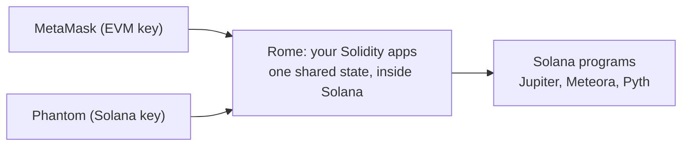
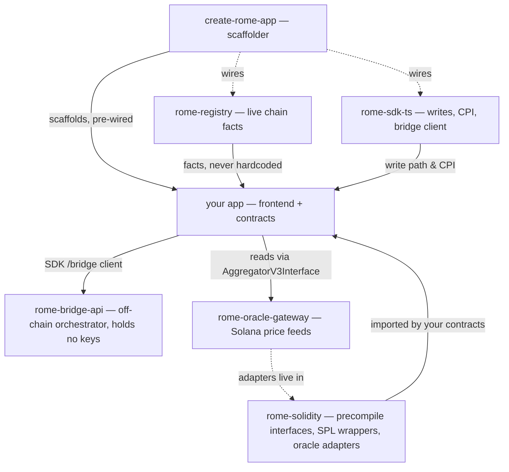

# Getting Started

EVM execution on Solana via Cross-Program Invocation.

Rome Protocol is an EVM execution environment running natively inside the Solana runtime. Deploy Solidity smart contracts on Solana with atomic CPI access to Solana programs and liquidity.

## What Makes Rome Different

* **Single State** — EVM contracts and Solana programs share the same state. No bridging, no sync delays.
* **CPI Access** — Solidity contracts call any Solana program directly, from SPL Token to Meteora.
* **Standard Tooling** — Deploy with Hardhat or Foundry. Interact with MetaMask. Write Solidity.
* **App Sovereignty** — Each app gets its own EVM chain with custom gas token and fee revenue.

## For Developers

* [What is Rome?](/getting-started/what-is-rome) — How EVM execution works on Solana
* [Quickstart](/getting-started/quickstart) — Deploy your first contract in under 5 minutes
* [Deploy Solidity](/developer-guides/deploy-solidity) — Hardhat and Foundry deployment guides
* [Call Solana from EVM](/developer-guides/call-solana-from-evm) — CPI from Solidity to Solana programs
* [Rome SDK](/products/rome-sdk) — Build against Rome from Solidity and Rust

## Apps on Rome

Rome is live software. See what's running today — DEX, lending, bridge, explorer, and more — in [Apps on Rome](/apps-on-rome/apps).

## Products

* [App Sovereignty](/products/app-sovereignty) — Launch your own EVM chain on Solana
* [Oracle Gateway](/products/oracle-gateway) — Pyth/Switchboard as Chainlink AggregatorV3Interface
* [Rome SDK](/products/rome-sdk) — Build against Rome from Solidity and Rust

## Core Concepts

* [Architecture](/getting-started/architecture) — System overview and component diagram
* [Execution Model](/core-concepts/execution-model) — Atomic vs iterative execution
* [Token Interop](/core-concepts/token-interop) — How ERC-20 and SPL tokens work together
* [Constraints](/core-concepts/constraints) — Important limits and boundaries

## Reference

* [Contract Addresses](/reference/contract-addresses) — Deployed addresses per chain
* [Glossary](/resources/glossary) — Rome-specific terminology
* [FAQ](/resources/faq) — Common questions answered

## Networks

Build against **Martius** (testnet) or **Hadrian** (devnet). Full details, wallet setup, and funding are on the [Networks](/networks/networks) page.

| Network                                | Chain ID | RPC URL                                     |
| -------------------------------------- | -------- | ------------------------------------------- |
| [Martius](/networks/martius) (testnet) | 121214   | `https://martius.testnet.romeprotocol.xyz/` |
| [Hadrian](/networks/hadrian) (devnet)  | 200010   | `https://hadrian.testnet.romeprotocol.xyz/` |
| Local                                  | 1001     | `http://localhost:9090`                     |

## Need Help?

* [Discord](https://discord.gg/vZ9rnCdNSB) — Developer community and support
* [Telegram](https://t.me/+tdnr-M6kcngxYzhk) — Updates and announcements
* [GitHub](https://github.com/rome-protocol) — Source code and issues


# What is Rome?

Rome is an EVM execution environment inside Solana. Whatever you build is open to EVM users, Solana users, and users on other chains. Four ways to build.

Rome is an EVM execution environment that runs inside Solana. Whatever you build on Rome is open to everyone at once — EVM users, Solana users, and users on other chains. You build once, and each of them can reach it.

## How Rome works

Rome embeds a full EVM bytecode interpreter as a Solana on-chain program. When you deploy a Solidity contract on Rome, it lives on Solana; when it runs, it runs inside Solana's runtime with direct access to any Solana program — SPL Token, Jupiter, Kamino, Meteora, or your own program — atomically, in one transaction. EVM and Solana share the same state, so a token on Solana and its ERC-20 form in the EVM are the same account: nothing is bridged or wrapped.

Because it all runs on Solana, **either wallet drives the same apps.** A MetaMask user signs an EVM transaction the usual way. A Phantom user signs with their **Solana** key — no EVM keypair, no separate address — and uses the very same Solidity apps directly. Both reach the same contracts and the same state, each with the identity they already have.



## How to use Rome

There are four ways to build on Rome. Each has a guide, and working code you can read.

### Bring your Solidity

Deploy your existing Solidity contracts as they are. On Rome they can call Solana programs atomically — a swap, a price read — inside one transaction, and the same contract is open to EVM wallets, Solana wallets, and users arriving from other chains.

**How to build it:** [Deploy Solidity](/developer-guides/deploy-solidity), then [Call Solana from EVM](/developer-guides/call-solana-from-evm).

**Examples to read:** Compound v3 and Aave v3 run on Rome unchanged — [compound-on-rome-comet](https://github.com/rome-protocol/compound-on-rome-comet), [rome-aave-v3](https://github.com/rome-protocol/rome-aave-v3). [Aerarium](https://github.com/rome-protocol/aerarium) is a lending app where EVM and Solana users share one market.

### Bring your Solana program

Your Solana program keeps doing what it already does for your Solana users. On Rome it also becomes reachable from Solidity, so EVM users — and users on other chains — can use it too, with no changes to the program.

**How to build it:** [Call a Solana program from EVM](/developer-guides/call-solana-from-evm); [Call EVM from Solana](/developer-guides/call-evm-from-solana) covers the other direction.

**Examples to read:** [cardo](https://github.com/rome-protocol/cardo) reaches Jupiter, Meteora, Marinade, and Mango from an EVM account.

### Bring your idea

Start something new that uses both sides from the beginning — one pool that EVM and Solana users share, a market both sides borrow from, an oracle that brings Solana prices into the EVM. Every audience can use it from day one.

**How to build it:** first [choose your core](/core-concepts/choose-your-core), then [Call Solana from EVM](/developer-guides/call-solana-from-evm) and the [DeFi patterns](/use-cases/defi-protocols).

**Examples to read:** [rome-dex](https://github.com/rome-protocol/rome-dex) is one pool traded by both EVM and Solana wallets; [rome-oracle-gateway](https://github.com/rome-protocol/rome-oracle-gateway) reads Solana price feeds and serves them to Solidity through a standard Chainlink interface.

### From home

Your users don't have to move. From their home chain — Arbitrum, Monad, or any other chain — they can reach a Rome app and get to Solana without leaving where they already are.

**How to build it:** [From home: reach Rome from another chain](/developer-guides/from-home).

**Examples to read:** [appia](https://github.com/rome-protocol/appia) — users bring USDC from their home chain and use Rome-side DeFi; [rome-bridge-api](https://github.com/rome-protocol/rome-bridge-api) is the bridge orchestrator.

## Run it on your own chain

When you're ready, you can run any of this on your own Rome chain, with your own gas token and fees that accrue to your app. See [App Sovereignty](/products/app-sovereignty).

## Prerequisites

* Solidity experience (Hardhat or Foundry), or a Solana program to bring
* A wallet — MetaMask and/or a Solana wallet like Phantom
* A basic grasp of Solana's account model (see [Key Concepts](/getting-started/key-concepts))

## What's Next

* [Quickstart](/getting-started/quickstart) — deploy your first contract in minutes
* [Architecture](/getting-started/architecture) — how EVM execution works inside Solana
* [Apps on Rome](/apps-on-rome/apps) — the full catalog of live apps and their repos


# Why Rome?

How Rome differs from other EVM-on-Solana approaches — atomic CPI composability, single shared state, and sovereign app chains with custom gas tokens.

Several projects bring EVM compatibility to Solana. Rome takes a fundamentally different approach.

## Core Differentiators

### 1. Atomic Composability via CPI

Rome is the only EVM environment where Solidity contracts can call Solana programs within the same transaction. A single Solidity function can:

```solidity
// All in one atomic transaction:
int256 price = IPyth(PYTH).getPrice("SOL/USD");        // Read Pyth oracle
uint256 quote = IJupiter(JUPITER).getQuote(USDC, SOL);  // Get Jupiter quote
IJupiter(JUPITER).swap(USDC, SOL, amount, minOut);       // Execute swap
IKamino(KAMINO).deposit(SOL, collateralAmount);          // Supply to Kamino
```

If any step fails, the entire transaction reverts. No partial execution, no race conditions.

### 2. Single State

On Rome, an SPL token and its ERC-20 representation are the same underlying account. When a Solidity contract transfers USDC, it's moving the actual SPL USDC — not a wrapped copy.

This means:

* **No liquidity fragmentation** — Solana DeFi and EVM DeFi share the same pools
* **No bridging risk** — there's no bridge to exploit because there's no bridge
* **Real-time composability** — EVM contracts see Solana state changes immediately

### 3. App Sovereignty

Each application on Rome gets its own EVM environment:

* **Custom chain ID** — your app is its own chain
* **Custom gas token** — any SPL token, priced via Meteora LP pool
* **Gas revenue** — fees accrue to your application, not Rome protocol
* **Full EVM tooling** — your users connect MetaMask, your devs use Hardhat

## When to Use Rome

**Use Rome when:**

* You want EVM contracts with direct access to Solana DeFi
* You want a sovereign EVM chain on Solana with your own gas token
* You're porting Ethereum contracts that need Solana's speed and liquidity
* You need atomic operations across EVM and Solana programs

**Consider alternatives when:**

* You only need standard Solana programs (use native Solana/Anchor)
* You need Ethereum mainnet settlement (use a traditional L2)
* You need cross-chain messaging without EVM execution (use Wormhole/Hyperlane directly)

## What's Next

* [Architecture](/getting-started/architecture) — how Rome EVM works inside Solana
* [Quickstart](/getting-started/quickstart) — deploy your first contract


# Architecture

How Rome's components fit together — EVM execution inside a Solana program.

Rome embeds an EVM bytecode interpreter inside a Solana on-chain program. Users talk to the Rome Proxy over standard Ethereum JSON-RPC, and the proxy submits their transactions straight to the Rome EVM program on Solana. There is no separate execution layer to keep in sync — EVM state *is* Solana state.

## System overview

<figure><figcaption></figcaption></figure>

## Components

### Rome EVM Program (on-chain)

The core of Rome — a Solana BPF program containing a full EVM bytecode interpreter (a fork of SputnikVM). It:

* Receives serialized EVM transactions as Solana instructions
* Executes Solidity bytecode inside the Solana runtime
* Maps each Ethereum address (H160) to a Solana PDA
* Exposes precompiles for calling into Solana (CPI, System, Helper, Withdraw) alongside the standard Ethereum precompiles
* Stores EVM state (balances, nonce, code, storage) as Solana account data

### Rome Proxy (JSON-RPC server)

A standard Ethereum JSON-RPC server on port 9090 — the entry point for the public chains. It translates Ethereum API calls into Solana activity:

* `eth_sendRawTransaction` → serialize the EVM tx → submit a Solana instruction
* `eth_call` → emulate execution off-chain via the Mollusk SVM emulator
* `eth_estimateGas` → simulate for gas estimation
* `eth_getBalance`, `eth_getCode`, `eth_getBlockByNumber`, receipts, logs → served from indexed state

It also exposes Rome extensions: `rome_emulateTx`, `rome_emulateRegRollup`, `rome_mintId`, `rome_buildInfo`, `rome_getResources`, and more.

### Hercules (indexer)

Watches the Rome EVM program on Solana and reconstructs Ethereum-compatible blocks — transactions, receipts, logs, and state changes — backed by PostgreSQL. On the public chains it runs in slot-aligned mode, so a block number maps to a Solana slot and the same slot yields the same block on any indexer. The proxy serves these blocks to wallets and explorers.

### Precompiles

Rome implements the standard Ethereum precompiles (ecrecover, SHA-256, RIPEMD-160, identity, modexp, the BN254 curve operations, blake2f) with mainnet-equivalent semantics, plus non-EVM precompiles that reach into Solana: **CpiProgram** (`0xFF…08`, arbitrary CPI), **System** (`0xFF…07`, PDA derivation and base58 helpers), **HelperProgram** (`0xFF…09`, ATA/PDA creation, SPL transfers, gas↔lamports), and **Withdraw** (`0x42…16`). See the [Contract Addresses](/reference/contract-addresses) reference for the full table.

## Execution modes

Rome executes an EVM transaction in one of two ways:

### Atomic (VmAt)

A single Solana transaction. The whole EVM transaction executes within one Solana transaction's compute budget (\~1.4M compute units). Used for most operations — transfers, ordinary contract calls, swaps.

### Iterative (VmIt)

For work that exceeds a single transaction's budget. Execution is split across multiple Solana transactions:

1. Each step (a Solana transaction) runs as many EVM opcodes as fit in its compute budget — the step size is adaptive, not fixed
2. VM state is Borsh-serialized into a `StateHolder` account between steps
3. Accounts are TTL-locked for a few seconds during execution
4. Used for heavy operations such as BN254 pairing

## Account mapping

Every Ethereum address maps deterministically to a Solana PDA derived from the chain ID and the address under the Rome EVM program. That PDA owns the account's balance (as SPL token accounts), contract code, storage slots, and nonce — all as Solana account data.

## Holder accounts

Solana transactions are capped at 1,232 bytes, but EVM transactions (especially contract deployments) can be much larger. Rome stages large transactions into **holder accounts**: the transaction is split into chunks written sequentially into a holder (up to 80 KB), then assembled and executed on-chain. The Rome SDK manages this transparently.

## Gas and pricing

Each chain has its own gas token — any SPL token. Gas pricing reads a Meteora DAMM pool (v1 or v2, configurable) to convert between the gas token and SOL for the underlying Solana transaction fees.

## What's next

* [Networks](/networks/networks) — connect to Martius or Hadrian
* [Quickstart](/getting-started/quickstart) — deploy your first contract
* [Execution Model](/core-concepts/execution-model) — atomic vs iterative execution in depth


# Ecosystem & repos

Every public Rome repo, what it is, and how they compose — the map for navigating the surface.

Rome's public surface is a set of repositories: a few **foundation** packages you build on, a scaffolder, reference apps to learn from, and two services your app calls. This page is the map — what each repo is and how they fit together.

Two neighbours answer different questions, and this page links to both rather than repeating them:

* [Architecture](/getting-started/architecture) explains the **protocol** — how the EVM runs inside a Solana program.
* Each repo ships an **`AGENTS.md`** (e.g. [rome-sdk-ts/AGENTS.md](https://github.com/rome-protocol/rome-sdk-ts/blob/main/AGENTS.md)) that routes by **what you're starting from** (a Solidity contract, a Solana program, greenfield, from-home) to the one example closest to your case.

This page is the level in between: the **whole surface** and how the pieces connect.

## The surface at a glance

### Foundation — build on these

| Repo                                                            | What it is                                                                                                                                                  | Reach for it when                                |
| --------------------------------------------------------------- | ----------------------------------------------------------------------------------------------------------------------------------------------------------- | ------------------------------------------------ |
| [rome-registry](https://github.com/rome-protocol/rome-registry) | `@rome-protocol/registry` — read-only, generated projection of live chain facts (ids, RPC, addresses, token mints, program ids, oracle feeds, ALTs).        | You need a real chain fact — never hardcode one. |
| [rome-sdk-ts](https://github.com/rome-protocol/rome-sdk-ts)     | `@rome-protocol/sdk` — the TypeScript write path: `submitRomeTx` + fee sizing, both lanes, PDA/ATA + CPI encoders, precompile bindings, a `/bridge` client. | You're writing app or frontend code.             |
| [rome-solidity](https://github.com/rome-protocol/rome-solidity) | Solidity precompile interfaces, SPL/ERC-20 wrappers, and the oracle adapters — the contract-side toolkit.                                                   | You're writing contracts.                        |

### Reference apps — learn by example

| Repo                                                                    | What it is                                                                                | Reach for it when                                    |
| ----------------------------------------------------------------------- | ----------------------------------------------------------------------------------------- | ---------------------------------------------------- |
| [rome-dex](https://github.com/rome-protocol/rome-dex)                   | Dual-lane AMM — a native Solana pool with a thin EVM router.                              | Opening the other lane; a **native-core** example.   |
| [aerarium](https://github.com/rome-protocol/aerarium)                   | Dual-lane lending — a Solidity Comet core that Solana users reach via a synthetic sender. | Opening the other lane; a **Solidity-core** example. |
| [cardo](https://github.com/rome-protocol/cardo)                         | EVM users driving Solana dApps (swap/stake/lend/perps) via CPI.                           | A worked CPI-to-Solana app to study.                 |
| [appia](https://github.com/rome-protocol/appia)                         | Positions-first cross-VM DeFi; users reach it from their home chain.                      | A **from-home** app.                                 |
| [rome-aave-v3-demo](https://github.com/rome-protocol/rome-aave-v3-demo) | Aave v3 supply/borrow/repay, deployed unchanged.                                          | A full EVM app running as-is.                        |

### Contract forks — known protocols, deployed on Rome

| Repo                                                                              | What it is                         | Reach for it when             |
| --------------------------------------------------------------------------------- | ---------------------------------- | ----------------------------- |
| [compound-on-rome-comet](https://github.com/rome-protocol/compound-on-rome-comet) | Compound III (Comet) money market. | Forking a known EVM protocol. |
| [rome-aave-v3](https://github.com/rome-protocol/rome-aave-v3)                     | Aave v3 contracts fork.            | Forking a known EVM protocol. |

### Services — your app calls these

| Repo                                                                        | What it is                                                                                       | Reach for it when                      |
| --------------------------------------------------------------------------- | ------------------------------------------------------------------------------------------------ | -------------------------------------- |
| [rome-bridge-api](https://github.com/rome-protocol/rome-bridge-api)         | Off-chain orchestrator + fee-sponsor for the on-chain bridge. Holds no keys.                     | Funding a wallet, or a from-home flow. |
| [rome-oracle-gateway](https://github.com/rome-protocol/rome-oracle-gateway) | Solana price feeds (Pyth, Switchboard) exposed to EVM via the Chainlink `AggregatorV3Interface`. | You need a price feed.                 |

### Scaffold — start here

| Repo                                                                | What it is                                                                                                                             | Reach for it when   |
| ------------------------------------------------------------------- | -------------------------------------------------------------------------------------------------------------------------------------- | ------------------- |
| [create-rome-app](https://github.com/rome-protocol/create-rome-app) | `npx github:rome-protocol/create-rome-app` — scaffolds a dual-lane app pre-wired to the registry + SDK, with a funded both-lane check. | Starting a new app. |

## How they compose



The spine is three foundations and a scaffolder:

* [**rome-registry**](https://github.com/rome-protocol/rome-registry) is the single source of live facts. [**rome-sdk-ts**](https://github.com/rome-protocol/rome-sdk-ts) is the write path — and its `/bridge` subpath is the client your app uses to talk to `rome-bridge-api`. [**rome-solidity**](https://github.com/rome-protocol/rome-solidity) is what your contracts (and the forks) import; the oracle adapters that `rome-oracle-gateway` deploys live there too. The three are independent of each other — pick the ones your app needs.
* [**create-rome-app**](https://github.com/rome-protocol/create-rome-app) ties the first two together for a new app, so a fresh project starts already reading the registry and writing through the SDK.

The reference apps are the exception worth knowing: **they predate the extracted packages.** cardo consumes the registry package; appia projects the registry to static JSON at build time; and both vendor their write path rather than importing the SDK. Read them to learn the patterns — but a **new** app should start from `create-rome-app` + the packages, not by cloning an app.

## Navigate by what you need

* **A live chain fact** (id, address, mint, program id) → [rome-registry](https://github.com/rome-protocol/rome-registry). Never hardcode.
* **Writing app code** (a write, a CPI call, a bridge) → [rome-sdk-ts](https://github.com/rome-protocol/rome-sdk-ts); reference at [Rome SDK](/products/rome-sdk).
* **Writing contracts** → [rome-solidity](https://github.com/rome-protocol/rome-solidity); see [Deploy Solidity Contracts](/developer-guides/deploy-solidity).
* **Calling a Solana program from a Solidity contract** → the CPI precompile in [rome-solidity](https://github.com/rome-protocol/rome-solidity) (`interface.sol`); [cardo](https://github.com/rome-protocol/cardo) is a worked example.
* **A working example** of an AMM, lending, CPI, or from-home app → the reference apps above; each repo's `AGENTS.md` routes by starting point.
* **Scaffolding a new app** → [create-rome-app](https://github.com/rome-protocol/create-rome-app).
* **A price feed** → [rome-oracle-gateway](https://github.com/rome-protocol/rome-oracle-gateway) (see the [Oracle Gateway portal](/apps-on-rome/oracle-gateway)).
* **Users on another chain** → [From home](/developer-guides/from-home) + [rome-bridge-api](https://github.com/rome-protocol/rome-bridge-api).
* **Deciding which side holds your logic** → [Choose your core](/core-concepts/choose-your-core).

## The foundation layer, up close

### rome-registry — live facts, public by construction

The registry is **generated** from Rome's internal source: an allowlist emits only what's meant to be public, **substitutes** internal endpoints for their public equivalents, and **default-denies** everything else — so it's public-safe by construction. It publishes, per chain, `chain.json` / `tokens.json` / `contracts.json` / `oracle.json` / `bridge.json` / `alts.json`, plus Solana `programs` and per-protocol app deployments.

You read it through getters — `getChain`, `getTokens`, `getContracts`, `getOracle`, `getBridge`, `getAlts`, and `getPrograms(network)` (program ids are keyed by network, not chain id). The package is plain ESM (no bundled TypeScript types today).

Two things to know before you wire it in:

* **`getTokens()` doesn't return `assetRef`.** To find a token's wrapper, match on its **mint** (`mintId`) — e.g. the gas token's wrapper is the entry that shares its mint.
* **It reads JSON from disk (`node:fs`) — it is not browser-safe.** In a web app, project the values you need to a static JSON file at build time and import that in the client. (This is exactly what `create-rome-app` and appia do.)

Facts your app doesn't read live also appear in the [Contract Addresses](/reference/contract-addresses) reference.

### rome-sdk-ts — the write path, both lanes

`@rome-protocol/sdk` (v0.2.1) wraps everything a Rome write needs so you don't hand-roll calldata or fees:

* **`submitRomeTx`** — the EVM-lane write path: sizes gas off `eth_estimateGas` (padded, with a fallback ceiling when estimation reverts) and supplies EIP-1559 fees.
* **`submitRomeTxSolanaLane`** — the same, for a **Phantom/Solana** wallet driving your EVM app. The synthetic sender holds nothing at rest; `buildFundLeg`/`buildSweepLeg` move value in and out as an ERC-20 (`wUSDC`), **not** native `msg.value`, and a fresh synthetic is auto-provisioned (`create_pda`) on first use.
* **PDA/ATA derivation, CPI `invoke`/`invoke_signed` encoders, precompile bindings**, and a **`/bridge`** subpath (`@rome-protocol/sdk/bridge`) — quote-first bridge client.

Full API + examples: [Rome SDK](/products/rome-sdk), and the guides [Call Solana from EVM](/developer-guides/call-solana-from-evm), [Call EVM from Solana](/developer-guides/call-evm-from-solana), and [Build a dual-lane app](/developer-guides/dual-lane-app).

### rome-solidity — the contract-side toolkit

What your contracts import:

* **`contracts/interface.sol`** — the precompile interfaces bound to their addresses: **CPI** `ICrossProgramInvocation` (`0xFF…08`), **Helper** `IHelperProgram` (`0xFF…09`, ATA/PDA creation, SPL transfers, gas↔lamports), **Withdraw** `IWithdraw` (`0x42…16`), and **System** (`0xFF…07`). A gas-optimised **cached** family also lives here; a contract uses one track consistently. Full address table: [Contract Addresses](/reference/contract-addresses).
* **SPL/ERC-20 wrappers** — `SPL_ERC20` (CPI-based) and `SPL_ERC20_cached` (the cached track, used on devnet); any SPL mint is already an ERC-20 through these.
* **Oracle adapters** (`contracts/oracle/`) — the Pyth/Switchboard adapters `rome-oracle-gateway` deploys, read via `IAggregatorV3Interface`.
* Worked examples in `contracts/examples/`.

The Solidity SDK section of [Rome SDK](/products/rome-sdk) shows the import patterns and the precompile bindings in code.

## What's next

* [Choose your core](/core-concepts/choose-your-core) — which side holds your logic.
* [Quickstart](/getting-started/quickstart) — deploy your first contract.
* [create-rome-app](https://github.com/rome-protocol/create-rome-app) — scaffold a dual-lane app.
* Each repo's `AGENTS.md` — the by-starting-point route to the closest example.


# Quickstart

Deploy your first Solidity contract on Rome in under 5 minutes.

Deploy your first Solidity contract on Rome in under 5 minutes. This guide targets **Martius**, the public testnet chain; the same steps work on [Hadrian](/networks/hadrian) (devnet) by swapping the network values.

## Prerequisites

* [Node.js](https://nodejs.org/) v22.13+
* [MetaMask](https://metamask.io/) browser extension
* A Solana wallet (e.g. Phantom) set to **Devnet**

## 1. Add Martius to MetaMask

Add it manually (Settings → Networks → Add network):

| Field           | Value                                           |
| --------------- | ----------------------------------------------- |
| Network Name    | Rome Martius                                    |
| RPC URL         | `https://martius.testnet.romeprotocol.xyz/`     |
| Chain ID        | `121214`                                        |
| Currency Symbol | `USDC`                                          |
| Block Explorer  | `https://via-martius.testnet.romeprotocol.xyz/` |

## 2. Fund your wallet

Gas is paid in the chain's SPL gas token (USDC on Martius). Two ways to get it:

**From Solana** — get devnet SOL from the [Solana faucet](https://faucet.solana.com/) (set your Solana wallet to Devnet), then open the [Rome App](https://app.testnet.romeprotocol.xyz), connect both wallets, and wrap into the gas token.

**By bridging in** — mint test USDC on Ethereum Sepolia from the [Circle faucet](https://faucet.circle.com/), then bring it to Rome with the [Rome Bridge](/apps-on-rome/bridge-api) (CCTP). You'll need a little Sepolia ETH for the source-side transaction — see [Faucets](/resources/faucets) for every faucet.

**How much?** Contract deploys on Rome carry Solana-side account costs, so gas estimates run well above Ethereum intuition — the quickstart contract estimates \~20M gas and costs about **0.2 USDC** to deploy, and wallets pre-check roughly double the estimate up front. Fund at least **0.5 USDC of gas**; 1 USDC leaves comfortable headroom.

If a Solana-side deposit fails with an "insufficient SOL" warning despite a funded wallet, set your Solana wallet to Testnet Mode / Devnet (see the [FAQ](/resources/faq)).

## 3. Create a Hardhat project

```bash
mkdir rome-hello && cd rome-hello
npx hardhat --init
```

Accept the defaults when prompted — Hardhat 3, the current directory, and the TypeScript + Node Test Runner + viem template — and let it install dependencies. The template ships an example `Counter` contract with tests; they don't interfere with this guide.

## 4. Configure Hardhat for Rome

Edit the generated `hardhat.config.ts` and add the Rome networks inside `defineConfig({ ... })`:

```typescript
  networks: {
    martius: {
      type: "http",
      chainType: "l1",
      chainId: 121214,
      url: "https://martius.testnet.romeprotocol.xyz/",
      accounts: [configVariable("PRIVATE_KEY")],
    },
    rome_local: {
      type: "http",
      chainType: "l1",
      chainId: 1001,
      url: "http://localhost:9090",
      accounts: [configVariable("PRIVATE_KEY")],
    },
  },
```

`configVariable("PRIVATE_KEY")` resolves from the environment, so export your MetaMask private key:

```bash
export PRIVATE_KEY="0xYOUR_PRIVATE_KEY"
```

(For anything beyond a throwaway key, prefer the encrypted keystore that ships with the toolbox: `npx hardhat keystore set PRIVATE_KEY`.)

## 5. Write a contract

Create `contracts/HelloRome.sol`:

```solidity
// SPDX-License-Identifier: MIT
pragma solidity ^0.8.28;

contract HelloRome {
    string public greeting = "Hello from Solana!";
    uint256 public counter;

    event Greeted(address indexed sender, uint256 count);

    function greet() external returns (string memory) {
        counter++;
        emit Greeted(msg.sender, counter);
        return greeting;
    }

    function setGreeting(string calldata _greeting) external {
        greeting = _greeting;
    }
}
```

## 6. Deploy

Create `scripts/deploy.ts`:

```typescript
import hardhat from "hardhat";

async function main() {
  const { viem } = await hardhat.network.connect();
  const publicClient = await viem.getPublicClient();

  const hello = await viem.deployContract("HelloRome");
  console.log("HelloRome deployed to:", hello.address);

  const hash = await hello.write.greet();
  await publicClient.waitForTransactionReceipt({ hash });

  console.log("Counter:", (await hello.read.counter()).toString());
  console.log("Greeting:", await hello.read.greeting());
}

main().catch((error) => {
  console.error(error);
  process.exitCode = 1;
});
```

Deploy to Martius:

```bash
npx hardhat run scripts/deploy.ts --network martius
```

Expected output (your address will differ):

```
HelloRome deployed to: 0x09c437e305eeb698e1776cff23ca16c1bb25aabd
Counter: 1
Greeting: Hello from Solana!
```

Open the deployed address in the [explorer](https://via-martius.testnet.romeprotocol.xyz/) to see the Solana instructions behind your transaction. Your Solidity contract is now running on Solana.

## What's Next

* [Deploy Solidity](/developer-guides/deploy-solidity) — Hardhat and Foundry deployment in depth
* [Call Solana from EVM](/developer-guides/call-solana-from-evm) — call Solana programs from Solidity via CPI
* [Architecture](/getting-started/architecture) — how Rome executes EVM inside Solana

## Common Errors

| Error                | Cause                                                          | Fix                                                                                                           |
| -------------------- | -------------------------------------------------------------- | ------------------------------------------------------------------------------------------------------------- |
| `insufficient funds` | Not enough gas token — wallets pre-check \~2× the gas estimate | Fund at least 0.5 USDC of gas (see step 2) via the [Rome App](https://app.testnet.romeprotocol.xyz) or bridge |
| `nonce too low`      | Transaction nonce mismatch                                     | Reset the account (MetaMask → Settings → Advanced → Clear activity)                                           |
| `execution reverted` | Contract execution failed                                      | Check contract logic; use `eth_call` to debug                                                                 |
| Connection timeout   | RPC unreachable                                                | Verify the RPC URL                                                                                            |


# Key Concepts

Essential Solana and Rome EVM terminology for developers — programs, accounts, PDAs, CPI, SPL tokens, and atomic vs. iterative execution.

Essential terminology and concepts for building on Rome Protocol.

## Solana Concepts

**Program** — Solana's equivalent of a smart contract. Programs are stateless executables deployed on-chain. The Rome EVM is itself a Solana program.

**Account** — All state on Solana lives in accounts. Each account has an owner (program), a balance (lamports), and data. Unlike Ethereum, code and state are stored in separate accounts.

**PDA (Program Derived Address)** — A deterministic address derived from seeds and a program ID. PDAs allow programs to "own" accounts without a private key. Rome uses PDAs to map Ethereum addresses to Solana accounts.

**CPI (Cross-Program Invocation)** — One Solana program calling another within the same transaction. This is how Rome EVM contracts interact with Jupiter, Kamino, SPL Token, and other Solana programs.

**SPL Token** — Solana's standard token program. Equivalent to ERC-20 on Ethereum. All fungible tokens on Solana (USDC, SOL, etc.) are SPL tokens.

**Token-2022** — The next-generation SPL token program with extensions like Transfer Hooks, Confidential Transfers, and Permanent Delegates.

**Transfer Hook** — A Token-2022 extension that invokes a program on every `transfer_checked` call.

**ATA (Associated Token Account)** — A deterministic token account for a given wallet + mint pair. Every user has one ATA per token they hold.

**Lamports** — The smallest unit of SOL. 1 SOL = 1,000,000,000 lamports (10^9).

**Compute Units (CU)** — Solana's equivalent of Ethereum gas. Each transaction has a compute budget (default \~200K CU, max \~1.4M CU). Operations consume CU.

## Rome Concepts

**Rome EVM Program** — The Solana program that contains the EVM bytecode interpreter. Deployed at a specific program ID per environment.

**Chain ID** — Each application on Rome gets its own EVM chain ID. This creates isolated EVM environments that share the same underlying Solana state.

**Atomic Execution (VmAt)** — An EVM transaction that executes entirely within a single Solana transaction. Used for most operations.

**Iterative Execution (VmIt)** — An EVM transaction split across multiple Solana transactions, each step packing as many opcodes as fit in one Solana transaction's compute budget (adaptive, not a fixed count). Used for compute-intensive operations like BN254 pairing.

**Holder Account** — An on-chain buffer that stores large EVM transactions (up to 80 KB) that exceed Solana's 1,232-byte transaction size limit. Managed transparently by the SDK.

**StateHolder** — An on-chain account that stores serialized VM state between iterative execution steps.

**Rome Proxy** — The JSON-RPC server (port 9090) that translates Ethereum API calls into Solana transactions. Your MetaMask and Hardhat connect here.

**Hercules** — The block indexer that monitors Rome EVM events on Solana and produces Ethereum-compatible block data.

**Payer** — A Solana keypair that signs and pays for Solana transactions on behalf of EVM users. Managed by the Proxy via payer pools.

## Token Concepts

**SPL\_ERC20 / SPL\_ERC20\_cached** — ERC-20 wrapper contracts representing an SPL token inside Rome EVM. The wrapper reads balances directly from the underlying SPL token account — no separate state. The factory deploys the cached variant today.

**ERC20SPLFactory** — A factory contract that deploys wrappers for any SPL token.

**Registry** — Canonical wrappers, gas tokens, and bridge wiring are curated off-chain in the [rome-protocol/registry](https://github.com/rome-protocol/rome-registry); there is no on-chain token-registry contract. This keeps each asset mapped to a single canonical SPL mint.

## Precompiles

**Standard Ethereum Precompiles** — ecrecover (0x01), SHA-256 (0x02), RIPEMD-160 (0x03), identity (0x04), modexp (0x05), BN254 ecAdd/ecMul/ecPairing (0x06-0x08), Blake2f (0x09).

**System Precompile** (`0xFF...07`) — PDA derivation and base58 conversion from Solidity.

**CpiProgram Precompile** (`0xFF...08`) — Cross-program invocation (`invoke` / `invoke_signed`) plus cross-state read shortcuts.

**HelperProgram Precompile** (`0xFF...09`) — ATA/PDA creation, SPL transfers, and gas↔lamports conversion; the primary surface for user-PDA-signed SPL operations.

**Withdraw Precompile** (`0x42...16`) — Withdraw SOL or SPL tokens from EVM back to Solana.

A cached-track family (`0xff…04/05/06/0b`) mirrors these for CU-efficient reads; a contract uses one track consistently.

## Transaction Types

**RheaTx** — A single EVM transaction on one rollup. The most common type.

**RemusTx** — Multiple EVM transactions across different rollups, executed atomically. If any transaction fails, all revert.

**RomulusTx** — Combined EVM transactions + native Solana instructions in one atomic operation. The most powerful type — mix Solidity and Solana in a single transaction.

## What's Next

* [Execution Model](/core-concepts/execution-model) — deep dive into how EVM transactions execute on Solana
* [Token Interop](/core-concepts/token-interop) — how ERC-20 and SPL tokens interact
* [Constraints](/core-concepts/constraints) — important limits and boundaries


# Overview

Public Rome chains — chain IDs, RPC endpoints, explorers, and gas tokens.

Rome runs multiple public chains. Two are the ones to build against today: **Martius** (testnet) and **Hadrian** (devnet). Both are EVM chains that execute inside a Solana program and settle on Solana Devnet, so devnet SOL is not real money.

| Network                                | Chain ID | RPC                                         | Explorer                                                     | Gas token |
| -------------------------------------- | -------- | ------------------------------------------- | ------------------------------------------------------------ | --------- |
| [Martius](/networks/martius) (testnet) | 121214   | `https://martius.testnet.romeprotocol.xyz/` | [via-martius](https://via-martius.testnet.romeprotocol.xyz/) | USDC      |
| [Hadrian](/networks/hadrian) (devnet)  | 200010   | `https://hadrian.testnet.romeprotocol.xyz/` | [via-hadrian](https://via-hadrian.testnet.romeprotocol.xyz/) | USDC      |
| Local                                  | 1001     | `http://localhost:9090`                     | —                                                            | —         |

Chain metadata — chain IDs, contract addresses, token mints, gas pools — is canonical in the [Rome registry](https://github.com/rome-protocol/rome-registry). Don't hardcode addresses; read them from there.

## Add a network to your wallet

Each network page lists the manual MetaMask values. WebSocket subscriptions are served on the same host as the HTTPS RPC (swap `https://` for `wss://`).

## Fund a wallet

Rome's public chains settle on Solana Devnet. Get devnet SOL from the [Solana faucet](https://faucet.solana.com/), then obtain a chain's gas token through the [Rome App](https://app.testnet.romeprotocol.xyz) (wrap/bridge). For test tokens on every chain the bridge supports, see [Faucets](/resources/faucets).

## Local development

Develop against a public chain today — see the [Quickstart](/getting-started/quickstart). A self-contained local stack (chain ID 1001, Proxy on `:9090`) is on the roadmap.


# Martius (testnet)

Rome Martius — the public testnet chain (chain ID 121214).

Martius is Rome's public testnet chain. It's an EVM chain executing inside a Solana program and settling on Solana Devnet — a stable target for deploying and testing apps.

## Network details

| Field     | Value                                                                                 |
| --------- | ------------------------------------------------------------------------------------- |
| Chain ID  | `121214`                                                                              |
| RPC URL   | `https://martius.testnet.romeprotocol.xyz/`                                           |
| WebSocket | `wss://martius.testnet.romeprotocol.xyz/`                                             |
| Explorer  | [via-martius.testnet.romeprotocol.xyz](https://via-martius.testnet.romeprotocol.xyz/) |
| Gas token | USDC                                                                                  |

## Add to MetaMask

Enter the values above manually (Settings → Networks → Add network).

## Fund a wallet

1. Get devnet SOL from the [Solana faucet](https://faucet.solana.com/) (set your Solana wallet to Devnet).
2. Obtain gas via the [Rome App](https://app.testnet.romeprotocol.xyz) — wrap or bridge into the chain's gas token.

If a Solana-side transaction fails with an "insufficient SOL" warning despite a funded wallet, set your Solana wallet to Testnet Mode / Devnet (see the [FAQ](/resources/faq)).

## Contracts

Deployed contract addresses for Martius live in the [Rome registry](https://github.com/rome-protocol/rome-registry/tree/main/chains/121214-martius) and are summarized on the [Contract Addresses](/reference/contract-addresses) page.


# Hadrian (devnet)

Rome Hadrian — the public devnet chain (chain ID 200010).

Hadrian is Rome's public devnet chain and the canonical benchmark chain — the reference apps (Uniswap V3/V4, Compound, Aave) are validated here first. It's an EVM chain executing inside a Solana program and settling on Solana Devnet.

## Network details

| Field     | Value                                                                                 |
| --------- | ------------------------------------------------------------------------------------- |
| Chain ID  | `200010`                                                                              |
| RPC URL   | `https://hadrian.testnet.romeprotocol.xyz/`                                           |
| WebSocket | `wss://hadrian.testnet.romeprotocol.xyz/`                                             |
| Explorer  | [via-hadrian.testnet.romeprotocol.xyz](https://via-hadrian.testnet.romeprotocol.xyz/) |
| Gas token | USDC                                                                                  |

## Add to MetaMask

Enter the values above manually (Settings → Networks → Add network).

## Fund a wallet

1. Get devnet SOL from the [Solana faucet](https://faucet.solana.com/) (set your Solana wallet to Devnet).
2. Obtain gas via the [Rome App](https://app.devnet.romeprotocol.xyz) — wrap or bridge into the chain's gas token.

If a Solana-side transaction fails with an "insufficient SOL" warning despite a funded wallet, set your Solana wallet to Testnet Mode / Devnet (see the [FAQ](/resources/faq)).

## Contracts

Deployed contract addresses for Hadrian live in the [Rome registry](https://github.com/rome-protocol/rome-registry/tree/main/chains/200010-hadrian) and are summarized on the [Contract Addresses](/reference/contract-addresses) page.


# Overview

Live applications running on Rome — DeFi, explorers, bridges, and portals.

Rome is live software, not just a spec. These apps run on the public chains today and each one demonstrates a different way EVM and Solana meet on Rome — one shared state, no wrapped venue, no bridge between the two sides.

Links list the testnet deployment first where one exists; several apps also run on devnet.

## DeFi

| App          | What it is                                                                                                                        | Links                                                                                                               | Source                                                                                                                  |
| ------------ | --------------------------------------------------------------------------------------------------------------------------------- | ------------------------------------------------------------------------------------------------------------------- | ----------------------------------------------------------------------------------------------------------------------- |
| **Rome DEX** | One native Solana pool where Solana-address and EVM-address users trade and LP the same reserves — one market, two identities.    | [testnet](https://dex.testnet.romeprotocol.xyz/) · [devnet](https://dex.devnet.romeprotocol.xyz/)                   | [rome-dex](https://github.com/rome-protocol/rome-dex)                                                                   |
| **Aerarium** | Compound v3 with Solana and EVM identities in one pool — supply and borrow from either side of the same market.                   | [testnet](https://aerarium-martius.testnet.romeprotocol.xyz/) · [devnet](https://aerarium.devnet.romeprotocol.xyz/) | [aerarium](https://github.com/rome-protocol/aerarium)                                                                   |
| **Aave v3**  | Aave v3 deployed on Rome with live reserves — the same hardened Solidity, opened to both sides.                                   | [testnet](https://aave.testnet.romeprotocol.xyz/)                                                                   | [demo](https://github.com/rome-protocol/rome-aave-v3-demo) · [contracts](https://github.com/rome-protocol/rome-aave-v3) |
| **Cardo**    | Solana DeFi from an EVM account — Jupiter perps, Meteora swaps, Marinade staking, and more, with atomic multi-dapp Compose flows. | [testnet](https://cardo.testnet.romeprotocol.xyz/) · [devnet](https://cardo.devnet.romeprotocol.xyz/)               | [cardo](https://github.com/rome-protocol/cardo)                                                                         |
| **Appia**    | Solana positions for users of other chains — enter from an EVM chain, manage on Solana, exit home. *In validation.*               | [devnet](https://appia.devnet.romeprotocol.xyz/)                                                                    | [appia](https://github.com/rome-protocol/appia)                                                                         |

## Infrastructure

| App                                                | What it is                                                                                                                          | Links                                                                                                               | Source                                                                      |
| -------------------------------------------------- | ----------------------------------------------------------------------------------------------------------------------------------- | ------------------------------------------------------------------------------------------------------------------- | --------------------------------------------------------------------------- |
| **Rome App**                                       | The day-to-day utility surface — wrap, swap, LP, and bridge across Rome chains.                                                     | [testnet](https://app.testnet.romeprotocol.xyz/) · [devnet](https://app.devnet.romeprotocol.xyz/)                   | —                                                                           |
| [**Rome Bridge**](/apps-on-rome/bridge-api)        | A bridge across six chains on CCTP v2 and Wormhole rails, plus a public API any app integrates to embed bridging — no custody keys. | [devnet](https://bridge-api.devnet.romeprotocol.xyz/?chain=200010)                                                  | [rome-bridge-api](https://github.com/rome-protocol/rome-bridge-api)         |
| [**Via Explorer**](/apps-on-rome/via)              | The cross-VM explorer — every EVM transaction that touches Solana shows the exact Solana program and instruction behind it.         | [Martius](https://via-martius.testnet.romeprotocol.xyz/) · [Hadrian](https://via-hadrian.testnet.romeprotocol.xyz/) | —                                                                           |
| [**Oracle Gateway**](/apps-on-rome/oracle-gateway) | Pyth and Switchboard price feeds behind Chainlink-compatible interfaces, with keeper-guaranteed freshness.                          | [portal](https://oracle.testnet.romeprotocol.xyz/)                                                                  | [rome-oracle-gateway](https://github.com/rome-protocol/rome-oracle-gateway) |

## Build one

Building on Rome? Start with the [Quickstart](/getting-started/quickstart), then [Deploy Solidity](/developer-guides/deploy-solidity). To launch your own chain, see [App Sovereignty](/products/app-sovereignty).


# Rome Bridge

Rome Bridge — a standalone bridge and an integrable API, with no custody keys.

Rome Bridge is two things: a **standalone bridge** across six chains, and a **Bridge API** any app integrates to embed bridging in its own UX. It moves assets over CCTP v2 (USDC), Wormhole (ETH and generic assets), and Solana-native rails.

It holds **no custody keys** — settlement always requires the user's own signature, never the service's. The API orchestrates and can sponsor fees; the real bridge is on-chain.

## Supported chains and assets

Inbound to Rome (Martius, Hadrian), across four rails — `cctp`, `wormhole`, `spl-bridge`, `native`:

| Asset            | Rail                | Source chains                                                                                 |
| ---------------- | ------------------- | --------------------------------------------------------------------------------------------- |
| **USDC**         | CCTP                | Ethereum Sepolia, Arbitrum Sepolia, Base Sepolia, Polygon Amoy, Avalanche Fuji, Monad Testnet |
| **ETH**          | Wormhole            | Ethereum Sepolia                                                                              |
| **SPL / native** | spl-bridge / native | Solana                                                                                        |

The live set is always in [`/v1/chains`](https://bridge-api.devnet.romeprotocol.xyz/v1/chains). Need test tokens? See [Faucets](/resources/faucets).

## Use it standalone

Open the bridge UI: [bridge-api.devnet.romeprotocol.xyz](https://bridge-api.devnet.romeprotocol.xyz/?chain=200010). The `?chain=` parameter selects the destination Rome chain.

## Integrate the API

The API is public. List supported chains and rails:

```bash
curl https://bridge-api.devnet.romeprotocol.xyz/v1/chains
```

Quote and route requests take a CAIP-2 `sourceChain`. See the endpoint responses for the current rail set and required fields.

## How settlement works

The off-chain API is an orchestrator and fee sponsor only. Inbound transfers settle on-chain trustlessly via a user-signed authorization; outbound withdrawals go through the on-chain bridge contract. No step debits user funds without the user's signature.


# Oracle Gateway portal

The Oracle Gateway portal — register price feeds and configure consumers per chain.

The Oracle Gateway portal is the customer-facing surface for Rome's [Oracle Gateway](/products/oracle-gateway) — the system that exposes Pyth and Switchboard price feeds behind Chainlink-compatible interfaces, with a keeper guaranteeing freshness.

Use the portal to browse registered feeds and configure consumers per chain: [oracle.testnet.romeprotocol.xyz](https://oracle.testnet.romeprotocol.xyz/).

## What it covers

* **Registered feeds** — the price feeds live on each chain, with their sources and freshness windows.
* **Consumer configuration** — wiring a contract to read a feed through the Chainlink `AggregatorV3Interface`.

For the interface details, adapter architecture, and how the keeper keeps feeds fresh, see the [Oracle Gateway product page](/products/oracle-gateway). Deployed adapter addresses are canonical in the [registry](https://github.com/rome-protocol/rome-registry).


# Via Explorer

Via — the cross-VM block explorer for Rome chains.

Via is Rome's block explorer, built for the cross-VM model. Alongside the usual blocks, transactions, tokens, and addresses, it shows the **Solana side** of every EVM transaction — the exact Solana program and instruction each call resolved to.

Because a Rome EVM transaction executes inside a Solana program, "what actually happened on Solana" is the part a normal EVM explorer can't show. Via does.

## Instances

Via runs per chain:

* Martius (testnet): [via-martius.testnet.romeprotocol.xyz](https://via-martius.testnet.romeprotocol.xyz/)
* Hadrian (devnet): [via-hadrian.testnet.romeprotocol.xyz](https://via-hadrian.testnet.romeprotocol.xyz/)

## What to look for

Open any transaction and read the Solana instructions behind it — CPI calls into SPL Token, Meteora, or any Solana program, plus the compute units consumed. This is the reliable way to see real Solana cost (EVM `gasUsed` is not a faithful proxy for Solana compute units on Rome).


# Execution Model

How Rome EVM processes Ethereum transactions on Solana — proxy emulation, atomic (VmAt) vs. iterative (VmIt) modes, and the full transaction lifecycle.

Rome EVM executes Solidity bytecode inside a Solana on-chain program. This page explains how EVM transactions are processed.

## Transaction Lifecycle

```
1. User signs EVM transaction (MetaMask / ethers.js)
                    ↓
2. Rome Proxy receives via eth_sendRawTransaction
                    ↓
3. Proxy emulates transaction off-chain (Mollusk SVM emulator)
   → Estimates gas, checks atomicity, identifies required accounts
                    ↓
4. Proxy wraps EVM tx as Solana instruction(s)
   → If tx fits in one Solana tx → Atomic (VmAt)
   → If tx exceeds CU budget → Iterative (VmIt)
                    ↓
5. Solana validator executes the instruction(s)
   → Rome EVM program interprets EVM bytecode
   → CPI calls to other Solana programs (if any)
                    ↓
6. State changes committed to Solana accounts
                    ↓
7. Hercules indexes the event → produces EVM block
```

## Atomic Execution (VmAt)

The default mode. The entire EVM transaction executes within a single Solana transaction.

**State machine:** `Lock → Init → Execute → Commit → GasTransfer → Exit`

**Properties:**

* All-or-nothing execution — if any step fails, the entire transaction reverts
* \~1.4M compute units available per Solana transaction
* Suitable for transfers, simple contract calls, swaps, most DeFi operations
* Sub-second finality (Solana block time)

**When used:** Automatically selected when the emulator determines the transaction fits within a single Solana transaction's compute budget.

## Iterative Execution (VmIt)

For compute-intensive operations that exceed a single transaction's budget. The EVM execution is split across multiple Solana transactions.

**How it works:**

1. Each step (a Solana transaction) executes **as many EVM opcodes as fit in its compute budget** — an adaptive step size, not a fixed count
2. After each step, the VM state is serialized (Borsh format) into a `StateHolder` account
3. The next step deserializes state and continues execution
4. Accounts involved are TTL-locked for **3-4 seconds** during multi-step execution

**State machine:** `FromStateHolder → Lock → Init → Execute → Serialize → NextIteration → ... → Completed`

**Account locking:**

* **RoLock (shared read-only)** — Multiple iterative transactions can hold simultaneously
* **RwLock (exclusive write)** — Only one transaction can modify an account at a time
* **TTL:** 3 seconds (standard), 4 seconds (when using Address Lookup Tables)

**When used:** BN254 pairing verification, large contract deployments, deep call stacks, any operation exceeding \~1.4M CU.

## Emulation

Before submitting a transaction to Solana, the Proxy emulates it off-chain using the **Mollusk SVM emulator**. This:

1. Estimates gas consumption
2. Determines if atomic or iterative mode is needed
3. Identifies all Solana accounts the transaction will touch
4. Validates the transaction won't fail on-chain

The emulator executes the same EVM logic as the on-chain program — the `entrypoint!` macro ensures identical dispatch tables in both the program and emulator codebases.

**Mollusk SVM** can also execute arbitrary Solana BPF programs during emulation, which means `eth_call` and `eth_estimateGas` correctly handle CPI calls to SPL Token, Jupiter, Kamino, etc.

## Account Mapping

Every Ethereum address maps to a Solana PDA:

```
Ethereum address (H160, 20 bytes)
    ↓
PDA = findProgramAddress(
    [chain_id, "ACCOUN_SEED", H160, bump],
    ROME_EVM_PROGRAM_ID
)
    ↓
Solana account (Pubkey, 32 bytes)
```

**Account types stored on-chain:**

| Type        | Seeds                                        | Purpose                                  |
| ----------- | -------------------------------------------- | ---------------------------------------- |
| Balance     | `[chain, "ACCOUN_SEED", H160, bump]`         | Nonce, balance, contract code            |
| Storage     | `[chain, "STORAGE", H160, slot_index, bump]` | Contract storage (256 slots per account) |
| TxHolder    | `[signer, "TX_HOLDER_SEED", index, bump]`    | Staged transaction data (max 80 KB)      |
| StateHolder | `[signer, "STATE_HOLDER_SEED", index, bump]` | Serialized VM state between iterations   |

## Holder Accounts

Solana transactions are limited to 1,232 bytes. EVM transactions — especially contract deployments — can be much larger.

**Splitting mechanism:**

1. The SDK splits the RLP-encoded transaction into chunks
2. Each chunk is written to a `TxHolder` account via `TransmitTx` instructions
3. Once all chunks are staged, a `DoTxHolder` instruction assembles and executes the full transaction
4. Maximum holder size: **80 KB** per TxHolder

This is completely transparent to the developer — the Rome SDK handles splitting and reassembly automatically.

## Supported Transaction Types

| Type        | EIP       | Description                                          |
| ----------- | --------- | ---------------------------------------------------- |
| Legacy      | —         | Traditional Ethereum transactions                    |
| Access List | EIP-2930  | Optimized state access patterns                      |
| Dynamic Fee | EIP-1559  | Base fee + priority fee                              |
| Deposit     | Type 0x7E | Deposit transactions, e.g. bridge inbound settlement |

## Journaled State

Rome EVM uses a journaled state model for managing state changes during execution:

* All changes (nonce, balance, storage, code) are tracked in a `Journal`
* Nested CALL/CREATE operations push snapshot frames
* On revert: journal entries roll back to the snapshot
* On success: changes are committed to Solana accounts
* Non-EVM CPI instructions execute immediately (Solana's own atomicity guarantees correctness)

## What's Next

* [Compute Budget](/core-concepts/compute-budget) — CU costs and optimization strategies
* [Constraints](/core-concepts/constraints) — important limits and boundaries


# Compute Budget

Solana compute unit (CU) costs for Rome EVM operations — atomic vs. iterative budgets and how to design CU-efficient Solidity contracts.

Every Solana transaction has a compute budget measured in Compute Units (CU). Understanding CU costs helps you design efficient Rome contracts.

## Budget Overview

| Mode             | Max CU               | Notes                                                 |
| ---------------- | -------------------- | ----------------------------------------------------- |
| Atomic (VmAt)    | \~1,400,000 CU       | Single Solana transaction                             |
| Iterative (VmIt) | Unlimited (multi-tx) | Adaptive opcodes/step — packed to each tx's CU budget |

Each Solana transaction has a default budget of 200,000 CU, extendable to \~1.4M CU via compute budget instructions (added automatically by the Rome SDK).

## CU Cost Estimates

### EVM Operations

| Operation                          | Approximate CU       | Notes                        |
| ---------------------------------- | -------------------- | ---------------------------- |
| Signature verification (ecrecover) | \~5,000 CU           | secp256k1 via Solana syscall |
| Simple transfer                    | \~50,000-100,000 CU  | Balance updates only         |
| ERC-20 transfer                    | \~100,000-150,000 CU | Includes SPL precompile call |
| Contract deployment (small)        | \~200,000-400,000 CU | Depends on bytecode size     |
| Storage write (SSTORE)             | \~5,000-20,000 CU    | Cold vs warm access          |

### Precompile Operations

| Precompile      | Approximate CU   |
| --------------- | ---------------- |
| ecrecover       | \~3,000-5,000 CU |
| SHA-256         | \~1,000 CU       |
| BN254 ecAdd     | \~10,000 CU      |
| BN254 ecMul     | \~40,000 CU      |
| BN254 ecPairing | \~200,000+ CU    |

## Optimization Techniques

### 1. Use Yul for Hot Paths

Solidity's optimizer produces reasonable code, but Yul (inline assembly) can reduce CU significantly for critical operations:

```solidity
// Before: ~600K CU
function createPairAccount(bytes32 token0, bytes32 token1) external {
    // Solidity-level operations
}

// After: ~150K CU (Yul optimization)
function createPairAccount(bytes32 token0, bytes32 token1) external {
    assembly {
        // Direct memory manipulation, skip ABI encoding overhead
    }
}
```

### 2. Cache PDA Derivations

PDA derivation via `find_program_address` is expensive. Store derived PDAs in contract storage rather than computing them on every call:

```solidity
mapping(address => bytes32) private cachedPdas;

function getPda(address user) internal returns (bytes32) {
    bytes32 cached = cachedPdas[user];
    if (cached != bytes32(0)) return cached;

    bytes32 pda = RomeEVMAccount.pda(user);
    cachedPdas[user] = pda;
    return pda;
}
```

### 3. Hardcode Known Program IDs

Don't load program IDs from storage — use constants:

```solidity
// Expensive: reads from storage
bytes32 splTokenProgram = storage_program_id;

// Cheap: compile-time constant
bytes32 constant SPL_TOKEN_PROGRAM = 0x06ddf6e1d765a193d9cbe146ceeb79ac1cb485ed5f5b37913a8cf5857eff00a9;
```

### 4. Minimize Account Count

Each account in a Solana transaction adds CU overhead. Reduce the number of accounts by:

* Batching operations that share accounts
* Using fewer intermediate accounts
* Avoiding redundant ATA creation checks

### 5. Use Optimizer Settings

```typescript
// hardhat.config.ts — enable the optimizer in a build profile
solidity: {
  profiles: {
    default: { version: "0.8.28" },
    production: {
      version: "0.8.28",
      settings: { optimizer: { enabled: true, runs: 200 } },
    },
  },
}
```

Build with `npx hardhat compile --build-profile production`.

## Measuring CU Consumption

Use `eth_estimateGas` to measure CU before submitting:

```bash
cast estimate --rpc-url http://localhost:9090 \
  0xCONTRACT "myFunction(uint256)" 42
```

Or via ethers.js:

```javascript
const gas = await contract.myFunction.estimateGas(42);
console.log("Estimated gas:", gas.toString());
```

## What's Next

* [Constraints](/core-concepts/constraints) — full list of limits and boundaries


# Constraints

Limits when building on Rome EVM — Solana transaction size, \~1.4M CU budget, account caps, storage layout, and how Rome works around each.

Important limits and boundaries when building on Rome EVM. Understanding these constraints helps you design contracts that work reliably.

## Solana Transaction Limits

| Constraint                 | Value       | Impact                                                       |
| -------------------------- | ----------- | ------------------------------------------------------------ |
| Transaction size           | 1,232 bytes | Large EVM txs are split across holder accounts (transparent) |
| Compute units per tx       | \~1.4M CU   | Operations exceeding this use iterative mode                 |
| Accounts per tx (no ALT)   | 28          | Use Address Lookup Tables for more                           |
| Accounts per tx (with ALT) | 64+         | ALT automatically used when > 28 accounts                    |
| Max holder size            | 80 KB       | Max RLP size for a single EVM transaction                    |

## EVM Execution Limits

| Constraint             | Value                   | Notes                                                 |
| ---------------------- | ----------------------- | ----------------------------------------------------- |
| Contract storage slots | 256 per storage account | Multiple storage accounts can be created per contract |
| Opcodes per iteration  | Adaptive                | Packed to each Solana tx's CU budget (VmIt)           |
| Account lock TTL       | 3-4 seconds             | During iterative execution                            |
| Treasury wallets       | 64                      | Fee pool wallets                                      |
| Contract size limit    | 24 KB                   | Same as Ethereum (EIP-170, 24,576 bytes)              |

## CPI Constraints

| Constraint                | Value                     | Notes                                           |
| ------------------------- | ------------------------- | ----------------------------------------------- |
| CPI depth                 | 4 levels max              | Solana's CPI depth limit                        |
| Accounts per CPI call     | Limited by Solana tx size | Practically \~20 accounts per CPI               |
| CPI + Transfer Hook depth | Uses CPI levels           | Transfer hooks from inside CPI may exceed depth |

**CPI depth is the most critical constraint.** Rome EVM consumes one CPI level when Solana calls the Rome program. If your Solidity contract then calls another Solana program via CPI, that's level 2. If that program calls another, that's level 3. You have at most 4 levels total.

```
Level 0: Solana Runtime → Rome EVM Program
Level 1: Rome EVM Program → Your CPI target (e.g., Jupiter)
Level 2: Jupiter → another program (e.g., Raydium)
Level 3: Raydium → SPL Token (maximum depth)
```

## Token-2022 Transfer Hook Constraints

| Constraint              | Impact                                                                              |
| ----------------------- | ----------------------------------------------------------------------------------- |
| One hook per mint       | A Token-2022 mint has a single transfer-hook slot                                   |
| `transfer_checked` only | Hooks don't fire on plain `transfer`. Rome bridge operations use `transfer_checked` |
| Mint/burn not hooked    | Controlled via mint authority, not hooks                                            |

## Gas and Pricing Constraints

| Constraint           | Notes                                                      |
| -------------------- | ---------------------------------------------------------- |
| Gas pricing source   | Meteora DAMM pool, v1 or v2 (SPL gas token)                |
| Gas price multiplier | Configurable per proxy (`gas_price_mul`)                   |
| Minimum gas price    | Set by proxy configuration                                 |
| Gas estimation       | Performed off-chain via Mollusk emulator before submission |

## Network-Specific Constraints

| Environment       | Chain ID | rome-evm Program ID                           |
| ----------------- | -------- | --------------------------------------------- |
| Local             | 1001     | Local development stack                       |
| Hadrian (devnet)  | 200010   | `RPTWwELXAY4KC9ZPHhaxp7Sq1hHtU3HNEgLbSegCcWf` |
| Martius (testnet) | 121214   | `RomeTaTNPJNBxtB3Wong9geVTtkEFJfUqgktQVq3iSX` |

## Precompile Constraints

| Precompile                 | Constraint                                                   |
| -------------------------- | ------------------------------------------------------------ |
| Modexp (0x05)              | **Disabled** — can be enabled via feature flag               |
| BN254 ecPairing (0x08)     | High CU cost — typically requires iterative mode (\~200K CU) |
| CPI precompile (0xFF...08) | Accounts must be declared upfront in the Solana transaction  |

## Oracle Constraints

| Constraint            | Value                                                        |
| --------------------- | ------------------------------------------------------------ |
| Default max staleness | 60 seconds                                                   |
| Historical round data | Not supported — `getRoundData(roundId)` reverts              |
| Switchboard EMA       | Not supported — `latestEMAData()` reverts on SwitchboardV3   |
| Parser offsets        | Empirically validated — must re-validate before redeployment |

## Design Recommendations

1. **Keep CPI depth shallow.** Design contracts to minimize nesting. If you're calling Jupiter which calls Raydium which calls SPL Token, you're at 3 levels — dangerously close to the limit.
2. **Prefer atomic mode.** Design operations to fit within \~1.4M CU. Iterative mode adds latency (3-4 second locks) and complexity.
3. **Declare accounts upfront.** All Solana accounts touched by CPI must be known at transaction creation time. Dynamic account discovery within a CPI call is not possible.
4. **Use `transfer_checked`.** If you're building anything that touches Token-2022 tokens, always use `transfer_checked` to ensure hooks fire.
5. **Test CU consumption.** Measure real Solana compute units from the transaction receipt (`computeUnitsConsumed`) — EVM `gasUsed` is not a faithful proxy for Solana CU. Optimize with Yul for hot paths.

## What's Next

* [Compute Budget](/core-concepts/compute-budget) — detailed CU costs per operation
* [Token Interop](/core-concepts/token-interop) — ERC-20 ↔ SPL bridging model


# Token Interop

How ERC-20 and SPL tokens are the same underlying account on Rome.

Rome represents an ERC-20 token and its underlying SPL token as one shared account. This page explains how tokens work across EVM and Solana.

## The shared-state model

Rome doesn't lock tokens on one side and mint wrapped copies on another. An ERC-20 token on Rome is a **transparent wrapper** over an SPL token account on Solana — the ERC-20 balance *is* the SPL balance.

<figure><figcaption></figcaption></figure>

* No bridging delay — the ERC-20 balance is the SPL balance
* No liquidity fragmentation — DeFi on both sides sees the same tokens
* No bridge risk — there is no separate escrow to exploit

> Import paths below use `@rome-protocol/rome-solidity`. The npm publish is pending; today you consume these from the public [`rome-solidity`](https://github.com/rome-protocol/rome-solidity) repo (git dependency or copied interfaces). Precompile interfaces live in [`contracts/interface.sol`](https://github.com/rome-protocol/rome-solidity/blob/master/contracts/interface.sol).

## The wrapper contract

`SPL_ERC20` (and its cached-track variant `SPL_ERC20_cached`, which the factory deploys today) provide a full ERC-20 interface over an SPL mint:

* `balanceOf()` — reads the user's ATA balance from Solana
* `transfer()` — moves tokens on Solana
* `approve()` / `allowance()` — use EVM storage (SPL has no EVM-style allowances)
* `totalSupply()` — reads the SPL mint supply

## The factory

`ERC20SPLFactory` deploys a wrapper for any SPL mint:

```solidity
import {ERC20SPLFactory} from "@rome-protocol/rome-solidity/contracts/erc20spl/erc20spl_factory.sol";

// Deploy a wrapper, loading name/symbol from Metaplex metadata
address wrapper = factory.add_spl_token_with_metadata(splMint);

// Or specify name/symbol manually
address wrapper = factory.add_spl_token_no_metadata(splMint, "USD Coin", "USDC");
```

Live factory addresses: Hadrian `0x86149124d74ebb3aa41a19641b700e88202b6285`, Martius `0xd7aeeedca26cdd4d34eb7c21110af2e590a8c58a`. Always verify against the [registry](https://github.com/rome-protocol/rome-registry/tree/main/chains) — it is the source of truth for deployed addresses.

## Canonical mints

There is no on-chain token-registry contract. Canonical wrappers and gas/bridge tokens are curated in the off-chain [`rome-protocol/registry`](https://github.com/rome-protocol/rome-registry); permissionless wrappers created via `add_spl_token_no_metadata` are discovered from the on-chain `TokenCreated` event. This keeps each asset mapped to a single canonical SPL mint without fragmenting liquidity.

## SPL operations from Solidity

For user-PDA-signed SPL primitives, use the **HelperProgram** precompile (`0xFF…09`) — ATA creation, SPL transfers, and gas↔lamports conversion:

```solidity
import {IHelperProgram} from "@rome-protocol/rome-solidity/contracts/interface.sol";

IHelperProgram helper = IHelperProgram(0xFF00000000000000000000000000000000000009);

helper.create_ata(user, mint);              // create the user's ATA for a mint
helper.transfer_spl(to, tokens, mint);      // transfer SPL from the caller's PDA
```

`transfer_spl` has several overloads (including a delegate variant for `transferFrom` flows); see `interface.sol` for exact signatures. On the cached track, the equivalent operations live on `ISplCached` (`0xFF…05`) and `IAssociatedSplCached` (`0xFF…06`). A contract uses one track consistently.

## Deposit and withdraw

* **Into EVM** — the SPL side credits the user's PDA-owned ATA; the ERC-20 wrapper immediately reflects the balance. Cross-chain inbound transfers settle trustlessly via a user-signed authorization on the bridge.
* **Out to Solana** — call the `Withdraw` precompile (`0x42…16`): `withdraw_to_pda` / `withdraw_to_ata` move tokens from the user's PDA back to Solana. The wrap-gas-to-SPL path is `withdraw_to_ata`.

## Gas token

Each chain has its own gas token — any SPL token, priced via a Meteora DAMM pool (v1 or v2, configurable). The public chains (Martius, Hadrian) use USDC. There is no universal default gas token.

## Constraints

* SPL token amounts are `uint64` (max 18,446,744,073,709,551,615)
* Allowances use EVM storage, not Solana delegates
* ERC-20 wrapper symbols must be unique per factory

## What's Next

* [Contract Addresses](/reference/contract-addresses) — precompiles and per-chain addresses
* [Call Solana from EVM](/developer-guides/call-solana-from-evm) — CPI and SPL operations from Solidity


# Choose your core

A dual-lane app can hold its core logic on the Solidity side or the native Solana side. It's a judgment call — weigh what matters for your app.

Most Rome apps are dual-lane: one shared state, reached by both MetaMask (EVM) and Phantom (Solana) users. You can build one in two mirror-image shapes, differing in **which side holds the core logic.** There's no hard-and-fast rule for which to pick — it's a soft judgment from what matters for *your* app: the code and assets you already have, your team's expertise, your security posture, the tooling you prefer, performance, and how each audience will use it.

## (a) Solidity core; Solana users via a synthetic sender

Your logic is a Solidity contract. A Phantom user's Solana signature is executed as an EVM transaction from their Rome-derived identity (the `external_auth` PDA) — they never need an EVM key. Often a good fit when you already have a Solidity contract (especially a hardened or audited one), want standard EVM tooling (Hardhat / Foundry / viem), or the logic is straightforward.

*Read:* [aerarium](https://github.com/rome-protocol/aerarium) — a Compound v3 lending market (Solidity core) that EVM and Solana users share.

## (b) Native Solana program core; EVM users via a thin CPI router

Your logic is a native Solana program; a thin Solidity router lets EVM users reach it via CPI. Often a good fit when you already have a Solana program, or when running the core natively matters for what you're building.

*Read:* [rome-dex](https://github.com/rome-protocol/rome-dex) — a native AMM (Solana core) with an EVM router, so both lanes trade one pool.

## For example: performance

Performance is one thing that *might* tip the choice — consider it as an example. Native Solana execution can be considerably cheaper than the EVM interpreter for heavy logic: one swap we measured ran roughly 6× cheaper natively. If your app has a hot, compute-heavy path, that kind of difference might matter to you; if it doesn't, it probably won't drive the decision. Treat it as one input among many, not a rule.

## Whichever you choose

Keep the core **authority-agnostic** — act on whichever authority signs, so the caller can be a Solana pubkey *or* an EVM user's PDA — keep the account set lean and ALT-friendly so the EVM lane stays cheap, and **test both lanes.**

## What's next

* [Call Solana from EVM](/developer-guides/call-solana-from-evm) — the CPI mechanics for shape (b), and any Solidity→Solana call.
* [Compute Budget](/core-concepts/compute-budget) — more on execution cost.


# Rome SDK

Typed Solidity interfaces for calling Solana programs from EVM contracts, plus the Rust SDK behind Rome's off-chain services.

The Rome SDK provides typed Solidity interfaces for interacting with Solana programs from EVM smart contracts. It's the developer toolkit for building cross-runtime applications on Rome.

## SDKs

Rome has SDKs for three audiences — app builders (TypeScript), contract developers (Solidity), and infrastructure operators (Rust).

### TypeScript SDK (`@rome-protocol/sdk`)

**For dapp and frontend developers** — the SDK most app builders start with. [`@rome-protocol/sdk`](https://github.com/rome-protocol/rome-sdk-ts) wraps the Rome write path so a web app submits Rome transactions correctly: `submitRomeTx` (the correct write path plus gas/fee handling), PDA / ATA derivation, CPI `invoke` / `invoke_signed` encoders, precompile bindings, and a `/bridge` subpath. Repo-first install (npm publish pending):

```bash
npm install github:rome-protocol/rome-sdk-ts#v0.2.1
```

```typescript
import { submitRomeTx } from '@rome-protocol/sdk';
// Submit any Rome EVM write through the correct write path (handles gas/fee encoding).
```

The public reference apps — [rome-dex](https://github.com/rome-protocol/rome-dex) and [cardo](https://github.com/rome-protocol/cardo) — consume this SDK.

**Both lanes, one SDK.** `submitRomeTx` is the EVM lane (MetaMask). For the **Solana lane** — a Phantom/Solana wallet driving your EVM app — `submitRomeTxSolanaLane` mirrors it: the user signs a Solana transaction and Rome runs it as an EVM transaction from their derived identity, with no EVM key. Value moves in and out through `buildFundLeg` / `buildSweepLeg` as an ERC-20 wrapper (e.g. `wUSDC`), not native `msg.value` — the synthetic sender holds nothing at rest — and a first-time synthetic is auto-provisioned on first use. See [Build a dual-lane app](/developer-guides/dual-lane-app) and [Call EVM from Solana](/developer-guides/call-evm-from-solana).

### Solidity SDK (`@rome-protocol/rome-solidity`)

**For Solidity developers.** Provides the precompile interfaces, ERC-20/SPL wrappers, PDA derivation, and CPI utilities. The npm publish is pending; today you consume these from the public [`rome-solidity`](https://github.com/rome-protocol/rome-solidity) repo (git dependency or copied files).

```solidity
import {ISystemProgram, ICrossProgramInvocation, IHelperProgram, IWithdraw}
    from "@rome-protocol/rome-solidity/contracts/interface.sol";
import {SPL_ERC20} from "@rome-protocol/rome-solidity/contracts/erc20spl/erc20spl.sol";
import {RomeEVMAccount} from "@rome-protocol/rome-solidity/contracts/rome_evm_account.sol";
```

### Rust SDK (`rome-sdk`)

**For infrastructure operators.** A Rust workspace that handles transaction composition, Solana interaction, gas pricing, and block indexing. Used by the Proxy and Hercules.

## Solidity SDK: What's Included

### Precompile Interfaces

Bind an interface to its precompile address:

```solidity
ISystemProgram          constant System   = ISystemProgram(0xFF00000000000000000000000000000000000007);
ICrossProgramInvocation constant Cpi      = ICrossProgramInvocation(0xFF00000000000000000000000000000000000008);
IHelperProgram          constant Helper   = IHelperProgram(0xFF00000000000000000000000000000000000009);
IWithdraw               constant Withdraw = IWithdraw(0x4200000000000000000000000000000000000016);
// Cached track: ISplCached 0xff…05, IAssociatedSplCached 0xff…06, ISystemCached 0xff…04, IWithdrawCached 0xff…0b
```

### SPL Token Operations

Use `IHelperProgram` (`0xff…09`) for user-PDA-signed SPL primitives:

```solidity
// Create the caller's ATA for a mint
Helper.create_ata(user, mint);

// Transfer SPL from the caller's PDA
Helper.transfer_spl(to, tokens, mint);
```

On the cached track, the equivalent operations live on `ISplCached` (`0xff…05`) and `IAssociatedSplCached` (`0xff…06`). See `interface.sol` for all overloads; a contract uses one track consistently.

### PDA Derivation

```solidity
// Derive a user's Solana PDA
bytes32 userPda = RomeEVMAccount.pda(msg.sender);

// Derive PDA with salt (for creating multiple PDAs per user)
bytes32 pda = RomeEVMAccount.pda_with_salt(msg.sender, salt);

// Find arbitrary PDA
(bytes32 pda, uint8 bump) = SystemProgram.find_program_address(programId, seeds);
```

### Cross-Program Invocation

```solidity
// Call any Solana program
ICrossProgramInvocation.AccountMeta[] memory accounts = new ICrossProgramInvocation.AccountMeta[](2);
accounts[0] = ICrossProgramInvocation.AccountMeta(signerPda, true, true);
accounts[1] = ICrossProgramInvocation.AccountMeta(targetAccount, false, true);

CpiProgram.invoke(programId, accounts, instructionData);

// Call with PDA signing
CpiProgram.invoke_signed(programId, accounts, data, seeds);

// Read account data
(uint64 lamports, bytes32 owner, bool isSigner, bool isWritable, bool executable, bytes memory data)
    = CpiProgram.account_info(pubkey);
```

### ERC-20 over SPL Tokens

```solidity
// Deploy wrapper for any SPL mint
ERC20SPLFactory factory = ERC20SPLFactory(FACTORY_ADDRESS);
address wrapper = factory.add_spl_token_with_metadata(splMint);

// Use the wrapper as standard ERC-20
SPL_ERC20 token = SPL_ERC20(wrapper);
token.transfer(recipient, amount);
uint256 balance = token.balanceOf(user);
```

### Borsh Deserialization

```solidity
import {Convert} from "@rome-protocol/rome-solidity/contracts/convert.sol";

// Parse Solana account data (little-endian Borsh format)
(uint64 value, uint256 newOffset) = Convert.read_u64le(data, offset);
(bytes32 pubkey, uint256 newOffset2) = Convert.read_bytes32(data, offset);
```

### Metaplex Metadata

```solidity
import {MplTokenMetadataLib} from "@rome-protocol/rome-solidity/contracts/mpl_token_metadata/lib.sol";

// Load token metadata from Metaplex
MplTokenMetadataLib.Metadata memory meta = MplTokenMetadataLib.load_metadata(
    mintPubkey, mplProgramId, cpiAddress
);
string memory name = meta.name;
string memory symbol = meta.symbol;
```

## Rust SDK: Architecture

The Rust SDK is a Cargo workspace. Its core crates:

| Crate               | Purpose                                                                         |
| ------------------- | ------------------------------------------------------------------------------- |
| `rome-sdk`          | Core API: `Rome` struct, config, transaction types (RheaTx, RemusTx, RomulusTx) |
| `rome-evm-client`   | EVM rollup client, TxBuilder, ResourceFactory, emulator integration             |
| `rome-solana`       | Solana tower, RPC client, transaction batching and tracking                     |
| `rome-utils`        | RLP, hex, JSON-RPC, authentication utilities                                    |
| `rome-obs`          | OpenTelemetry observability (traces, metrics, logs)                             |
| `rome-meteora`      | Meteora DEX AMM pool adapters for gas pricing                                   |
| `rome-jito-bundler` | Jito bundle builder for atomic multi-transaction submission                     |

### Transaction Types

```rust
// Single rollup transaction
let rhea = RheaTx::new(signed_eth_tx);
let mut tx = rome.compose_rollup_tx(rhea).await?;
let sig = rome.send_and_confirm(&mut *tx).await?;

// Cross-rollup atomic transaction
let remus = RemusTx::new(vec![tx1, tx2]);
let mut tx = rome.compose_cross_rollup_tx(remus).await?;

// Cross-chain atomic transaction (EVM + Solana)
let romulus = RomulusTx::new(eth_txs, sol_ixs);
let mut tx = rome.compose_cross_chain_tx(romulus, signers).await?;
```

### Resource Pooling

The SDK pools Solana keypairs (payers) and holder account indices for parallel transaction submission:

```rust
let resource = resource_factory.get().await?;
let payer = resource.payer();       // Solana keypair
let holder = resource.holder();     // Holder account index
// Resource automatically returned to pool on Drop
```

## SDK Roadmap

### Built and Working

* SPL Token wrappers and precompile interfaces
* Meteora DAMM v1 swaps via CPI
* Oracle Gateway V1 + V2 (Pyth Pull, Switchboard V3)
* System Program helpers, Borsh deserialization
* ERC20SPL Factory + bridge contracts

## What's Next

* [Deploy Solidity](/developer-guides/deploy-solidity) — deploy your first contract using the SDK
* [Call Solana from EVM](/developer-guides/call-solana-from-evm) — use CPI to interact with Solana programs
* [Contract Addresses](/reference/contract-addresses) — deployed SDK contract addresses


# Rome CLI + MCP

The Rome developer CLI and MCP server — grounded chain facts, the right build pattern, and the Rome-unique actions (fund, deploy, verify) for a human or an AI agent.

`rome` carries a builder — human or AI agent — across the whole build-on-Rome lifecycle: grounded chain facts, the right pattern, contract calls, the funding on-ramp, deploy/send, cross-VM diagnosis, and a both-lane works-gate. One capability core, two aligned surfaces — a CLI (`rome <command>`) and an [MCP](https://modelcontextprotocol.io) server (`rome mcp`) — so an agent and a human share one mental model.

## Install

Repo-first (npm publish pending):

```bash
# one-shot, no install:
npx github:rome-protocol/rome-cli facts chain hadrian

# durable install — clone + link:
git clone https://github.com/rome-protocol/rome-cli
cd rome-cli && npm install && npm install -g .
```

A plain `npm install -g github:rome-protocol/rome-cli` does **not** work today — npm prepares the package's git dependencies without their own node\_modules ([rome-cli#25](https://github.com/rome-protocol/rome-cli/issues/25)). Use the npx one-shot or clone + link. Pin a tag (`github:rome-protocol/rome-cli#v0.8.0`) when you need reproducible runs.

## Two layers over one core

**Reads — grounding + diagnosis.** No keys; on both the CLI and the MCP server.

| Command                                                  | What it returns                                                                                             |
| -------------------------------------------------------- | ----------------------------------------------------------------------------------------------------------- |
| `rome facts chain·tokens·contracts·gas·balance·programs` | live chain facts from the registry + RPC — no hallucinated ids, addresses, or selectors                     |
| `rome cookbook patterns·cpi-recipe·errors`               | which example fits your goal · the CPI account-rules agents get wrong · decode a Rome failure → cause + fix |
| `rome call <chain> <addr> <sig> [args]`                  | read a contract (`eth_call`) — multi-value args go comma-separated in one argument: `"0xOwner…,0xSpender…"` |
| `rome doctor <chain>`                                    | preflight — chain live? RPC reachable? program configured? wallet funded?                                   |
| `rome tx <chain> <hash>`                                 | diagnose a tx — EVM receipt + the Solana settlement tx(s) + a Via link (Rome has no `debug_trace*`)         |
| `rome preset foundry\|hardhat <chain>`                   | a ready Rome network config for your toolchain + the quirks                                                 |

**Actions — sign on-chain.** CLI-only, key from the environment, **never** on MCP.

| Command                                                                    | What it does                                                                                                                                                                                                                                                                     |
| -------------------------------------------------------------------------- | -------------------------------------------------------------------------------------------------------------------------------------------------------------------------------------------------------------------------------------------------------------------------------- |
| `rome deploy <chain> <artifact>`                                           | deploy a compiled contract, handling Rome's gas quirks                                                                                                                                                                                                                           |
| `rome send <chain> <addr> <sig>`                                           | write to a contract via the correct Rome write path                                                                                                                                                                                                                              |
| `rome fund <chain> --from <src> --amount <usdc>`                           | bridge USDC → Rome gas (CCTP) — the "from home" on-ramp                                                                                                                                                                                                                          |
| `rome bridge <chain> --from <src> --amount <usdc> [--intent gas\|wrapper]` | bridge USDC **in** as gas or wUSDC                                                                                                                                                                                                                                               |
| `rome bridge <chain> --to <dest> --amount <usdc>`                          | bridge wUSDC **out** — burn on Rome; you claim on the destination (Rome sponsors inbound, not the outbound claim)                                                                                                                                                                |
| `rome activate <chain>`                                                    | one-time PDA funding required before the **first bridge out** (inbound is frictionless — needs none)                                                                                                                                                                             |
| `rome verify <chain> [--path …]`                                           | the **path-aware works-gate**, one per way in: `solidity` — the same contract answers on the EVM lane *and* the Solana lane · `solana-program` — an EVM-lane call drives your Solana program via CPI · `from-home` — bridge in → act on Rome → bridge out, the round trip proven |

## Wire it into an AI agent (MCP)

You don't run or host anything — your MCP client launches `rome mcp` (a stdio server) on demand. Register it once:

```json
{ "mcpServers": { "rome": { "command": "npx", "args": ["-y", "github:rome-protocol/rome-cli", "mcp"] } } }
```

(With the clone + link install, `{ "command": "rome", "args": ["mcp"] }` works too — the npx form just needs no prior install.)

The agent then calls tools like `facts_chain`, `cookbook_cpi_recipe`, `doctor`, `tx`, and `preset` — grounded on the live registry + RPC, so it stops guessing addresses and selectors. The MCP surface is **read-only and holds no keys** — safe to wire into any agent; it can never sign or move funds. The signing actions stay on the CLI, with the key supplied through the environment.

## The agent grounding loop

1. `rome cookbook patterns <what I'm building>` → which example repo + architecture
2. `rome facts chain <chain>` → RPC, program id, gas token (no hardcoding)
3. …write code against those exact values…
4. `rome verify <chain> --path <your way in>` → prove it works, whichever path you came by

## Learn more

* Repo + full guides: [`rome-protocol/rome-cli`](https://github.com/rome-protocol/rome-cli)
* [Ecosystem & repos](/getting-started/ecosystem) · [Build a dual-lane app](/developer-guides/dual-lane-app) · [From home: reach Rome from another chain](/developer-guides/from-home)


# App Sovereignty

Launch your own sovereign EVM chain on Solana — custom chain ID, any SPL token as gas, and gas revenue that accrues to your app's treasury.

App Sovereignty lets any Solana application launch its own EVM environment with a custom chain ID, custom gas token, and gas revenue that flows to the application — not a shared protocol.

## Overview

Each application on Rome gets a sovereign EVM instance:

* **Own chain ID** — your app is its own chain
* **Own gas token** — any SPL token (your project token, USDC, SOL)
* **Gas revenue** — all transaction fees accrue to your treasury
* **Full EVM tooling** — your users connect MetaMask, your devs use Hardhat/Foundry
* **Shared state** — EVM users and Solana users share the same application state and liquidity

## How It Works

1. **Onboard through the Sovereign Portal** — request a chain and configure your chain ID and gas token (any SPL mint) via the [Sovereign Portal](https://sovereign.devnet.romeprotocol.xyz)
2. **Rome brings up the chain** — the Rome team provisions and operates the chain's infrastructure
3. **Deploy contracts** — standard Solidity deployment with Hardhat or Foundry
4. **Users connect** — MetaMask with your chain ID, or any EVM wallet

Every live Rome chain — including the public reference chains [**Martius**](/networks/martius) and [**Hadrian**](/networks/hadrian) — is recorded in the public [Rome registry](https://github.com/rome-protocol/rome-registry) (chain id, RPC, contract addresses), so a sovereign chain is discoverable through the same canonical source builders already read.

## Gas Token Pricing

Custom gas tokens are priced via a Meteora DAMM pool — v1 or v2, configurable (a Pyth/Hermes fallback is also available). The Proxy configuration specifies a `price_manager` that reads the pool to convert between your gas token and SOL for underlying Solana transaction fees.

```yaml
# Proxy config for custom gas token
price_manager:
  type: "meteora_damm_v1_pool"   # meteora_damm_v1_pool | meteora_damm_v2_pool | hermes_api
  pool_address: "YOUR_METEORA_POOL_ADDRESS"
```

## Use Case: Prediction Market Launches EVM Chain

```
Orra (Solana prediction market) wants EVM users:
  1. Rome deploys Orra's sovereign EVM with ORRA token as gas
  2. EVM users connect MetaMask, bridge USDC, buy prediction shares
  3. Under the hood: rUSDC (ERC-20) → unwrap to SPL → Orra CPI → buy shares
  4. Orra earns gas fees in ORRA token from every EVM transaction
  5. Single state: Solana users and EVM users see same markets, same liquidity
```

## Status

**Live** — active product with partners.

## What's Next

* [Architecture](/getting-started/architecture) — how Rome EVM works under the hood
* [Quickstart](/getting-started/quickstart) — deploy your first contract
* [Deploy Solidity](/developer-guides/deploy-solidity) — deployment guide for Hardhat and Foundry


# Oracle Gateway

Pyth and Switchboard price feeds behind Chainlink's AggregatorV3Interface.

The Oracle Gateway exposes Solana-native price feeds (Pyth, Switchboard V3) through Chainlink's `AggregatorV3Interface`, so Ethereum protocols porting to Rome keep their existing oracle integration code. **Oracle Gateway V2 is live on every public chain**, with a keeper guaranteeing feed freshness and a customer portal for registration. The adapters, factory, and keeper model are covered in the [rome-oracle-gateway](https://github.com/rome-protocol/rome-oracle-gateway) repo.

## The problem

Ethereum DeFi expects Chainlink's `AggregatorV3Interface`:

```solidity
(, int256 price,,,) = priceFeed.latestRoundData();
```

Solana's oracle providers (Pyth, Switchboard) have different data formats. Without adaptation, every ported protocol would need custom oracle code.

## The solution

Oracle Gateway V2 deploys lightweight adapter contracts that:

1. Read price data directly from Pyth or Switchboard accounts on Solana (cross-state reads, not CPI)
2. Parse the on-chain data
3. Normalize prices to 8 decimals
4. Expose the standard Chainlink `AggregatorV3Interface`

```solidity
import {IAggregatorV3Interface} from "@rome-protocol/rome-solidity/contracts/oracle/IAggregatorV3Interface.sol";

// Same interface as Chainlink on Ethereum
(, int256 price,,,) = IAggregatorV3Interface(ADAPTER).latestRoundData();
// price = SOL/USD at 8 decimals (e.g. 15000000000 = $150.00)
```

## Adapter types

* **PythPullAdapter** — reads Pyth price accounts (price, confidence, EMA, publish time).
* **SwitchboardV3Adapter** — reads Switchboard aggregator accounts (price, timestamp; no EMA).
* **CachedPyth / CachedFeed adapters** — cached-track variants for CU-efficient reads.

Adapters are deployed as EIP-1167 minimal-proxy clones by the `OracleAdapterFactory` and expose an extended interface alongside `AggregatorV3Interface` (`latestPriceData`, `maxStaleness`, `oracleType`, and a `metadata()` surface used for health checks).

## Freshness — the oracle-keeper

Adapters enforce a `maxStaleness` window: if `block.timestamp - publishTime > maxStaleness`, reads revert. On Solana mainnet, Pyth runs production keepers. On Solana devnet (where the public chains live), Pyth's pushers are best-effort, so Rome runs its own **oracle-keeper** sidecar to keep the underlying Pyth accounts fresh. Freshness is monitored and alerted on.

Check feed health with `BatchReader.getFeedHealth` (which reads each adapter's `metadata()`), not just `latestRoundData` — a feed can be reachable but stale.

## Customer portal

Register feeds and configure consumers per chain through the [Oracle Gateway portal](https://oracle.testnet.romeprotocol.xyz/). See the [portal page](/apps-on-rome/oracle-gateway) for what it covers.

## Deployed addresses

Canonical per-chain addresses (factories, adapter implementations, and the live feeds) live in the [registry](https://github.com/rome-protocol/rome-registry/tree/main/chains). Headline factories:

| Contract             | Hadrian                                      | Martius                                      |
| -------------------- | -------------------------------------------- | -------------------------------------------- |
| OracleAdapterFactory | `0xe68e7bc697010c73f1798b356f8ae2f0ba1319db` | `0xbc06fe9603a02ff4aead265c253f5c6303ee5fbb` |
| BatchReader          | `0x306d670dff7f51ae33f263f5122bd2b18d98adc7` | `0xc5e6d932bfd2b4da27643848063905f46861fae8` |

## Constraints

* **No historical round data** — `getRoundData(roundId)` reverts; only `latestRoundData()` is supported.
* **Switchboard EMA not supported** — EMA data is Pyth-only.
* **Per-chain staleness** — `maxStaleness` defaults to 60 seconds and is set per environment at bring-up.
* **Parser offsets** are validated against current Pyth/Switchboard layouts; layout changes require re-validation.

## What's Next

* [Oracle Gateway portal](/apps-on-rome/oracle-gateway) — register feeds, configure consumers
* [Contract Addresses](/reference/contract-addresses) — precompiles and per-chain addresses


# Deploy Solidity Contracts

Deploy Solidity smart contracts on Solana with Hardhat or Foundry — Rome network configuration, funded accounts, and step-by-step deployment.

This guide covers deploying Solidity smart contracts on Rome EVM using Hardhat and Foundry.

## Prerequisites

* Node.js v22.13+ (Hardhat) or Foundry installed
* A funded Rome EVM address (see [Quickstart](/getting-started/quickstart))
* Your private key exported as an environment variable

```bash
export PRIVATE_KEY="0xYOUR_PRIVATE_KEY"
```

## Network Configuration

| Network           | RPC URL                                     | Chain ID |
| ----------------- | ------------------------------------------- | -------- |
| Local             | `http://localhost:9090`                     | `1001`   |
| Hadrian (devnet)  | `https://hadrian.testnet.romeprotocol.xyz/` | `200010` |
| Martius (testnet) | `https://martius.testnet.romeprotocol.xyz/` | `121214` |

## Hardhat

### Setup

```bash
mkdir my-rome-project && cd my-rome-project
npx hardhat --init
```

Accept the defaults (Hardhat 3, current directory, TypeScript + viem template); dependencies install automatically.

### hardhat.config.ts

```typescript
import hardhatToolboxViemPlugin from "@nomicfoundation/hardhat-toolbox-viem";
import { configVariable, defineConfig } from "hardhat/config";

export default defineConfig({
  plugins: [hardhatToolboxViemPlugin],
  solidity: {
    profiles: {
      default: { version: "0.8.28" },
      production: {
        version: "0.8.28",
        settings: { optimizer: { enabled: true, runs: 200 } },
      },
    },
  },
  networks: {
    rome_local: {
      type: "http",
      chainType: "l1",
      chainId: 1001,
      url: "http://localhost:9090",
      accounts: [configVariable("PRIVATE_KEY")],
    },
    hadrian: {
      type: "http",
      chainType: "l1",
      chainId: 200010,
      url: "https://hadrian.testnet.romeprotocol.xyz/",
      accounts: [configVariable("PRIVATE_KEY")],
    },
    martius: {
      type: "http",
      chainType: "l1",
      chainId: 121214,
      url: "https://martius.testnet.romeprotocol.xyz/",
      accounts: [configVariable("PRIVATE_KEY")],
    },
  },
});
```

`configVariable("PRIVATE_KEY")` resolves from the environment (or the encrypted keystore — `npx hardhat keystore set PRIVATE_KEY`).

### Deploy

```bash
npx hardhat run scripts/deploy.ts --network hadrian
```

### Verify on Block Explorer

```bash
npx hardhat verify --network martius 0xCONTRACT_ADDRESS
```

Needs the Sourcify verifier config from [Verify Contracts](/developer-guides/verify-contracts) in your `hardhat.config.ts`.

## Foundry

### Setup

```bash
forge init my-rome-project
cd my-rome-project
```

### Deploy

```bash
# Local
forge create --rpc-url http://localhost:9090 \
  --private-key $PRIVATE_KEY \
  src/Counter.sol:Counter

# Devnet
forge create --rpc-url https://hadrian.testnet.romeprotocol.xyz/ \
  --private-key $PRIVATE_KEY \
  src/Counter.sol:Counter
```

### Call Deployed Contract

```bash
# Read
cast call 0xCONTRACT_ADDRESS "number()" \
  --rpc-url https://hadrian.testnet.romeprotocol.xyz/

# Write
cast send 0xCONTRACT_ADDRESS "increment()" \
  --rpc-url https://hadrian.testnet.romeprotocol.xyz/ \
  --private-key $PRIVATE_KEY
```

## Using the Rome Solidity SDK

For contracts that interact with Solana programs, use the interfaces from the public [`rome-solidity`](https://github.com/rome-protocol/rome-solidity) repo (npm publish pending):

```solidity
// SPDX-License-Identifier: MIT
pragma solidity ^0.8.28;

import {ICrossProgramInvocation, IHelperProgram}
    from "@rome-protocol/rome-solidity/contracts/interface.sol";

contract MyRomeContract {
    IHelperProgram constant Helper =
        IHelperProgram(0xFF00000000000000000000000000000000000009);
    ICrossProgramInvocation constant Cpi =
        ICrossProgramInvocation(0xFF00000000000000000000000000000000000008);

    // Transfer an SPL token from the caller's PDA
    function moveSpl(address to, uint64 tokens, bytes32 mint) external {
        Helper.transfer_spl(to, tokens, mint);
    }

    // Invoke any Solana program via CPI
    function callSolanaProgram(
        bytes32 programId,
        ICrossProgramInvocation.AccountMeta[] calldata accounts,
        bytes calldata data
    ) external {
        Cpi.invoke(programId, accounts, data);
    }
}
```

## Bring an existing protocol

Any Solidity contract deploys on Rome unmodified — a compliance contract, a DeFi protocol, or an existing hardened application. Two production examples you can fork and deploy with the same Hardhat / Foundry flow above:

* [**compound-on-rome-comet**](https://github.com/rome-protocol/compound-on-rome-comet) — canonical Compound v3 (Comet), standard Foundry.
* [**rome-aave-v3**](https://github.com/rome-protocol/rome-aave-v3) — canonical Aave v3.

Both gain Solana execution and CPI composability with no contract changes.

## Deployment Constraints

| Constraint             | Limit              | Notes                                                        |
| ---------------------- | ------------------ | ------------------------------------------------------------ |
| Max contract size      | 24 KB              | Same as Ethereum (EIP-170, 24,576 bytes)                     |
| Transaction size limit | 80 KB per holder   | Large deploys are split across holder accounts transparently |
| Compute budget         | \~1.4M CU (atomic) | Use iterative mode for heavy contracts                       |
| Solidity version       | 0.8.28 recommended | Earlier versions work but 0.8.28 matches the SDK             |

## Common Errors

| Error                        | Cause                        | Fix                                                                                                              |
| ---------------------------- | ---------------------------- | ---------------------------------------------------------------------------------------------------------------- |
| `insufficient funds for gas` | EVM address has no gas token | Wrap gas via the [Rome App](https://app.devnet.romeprotocol.xyz) (see [Quickstart](/getting-started/quickstart)) |
| `nonce too low`              | Stale nonce in wallet        | Reset MetaMask account or specify nonce manually                                                                 |
| `execution reverted`         | Contract logic failed        | Debug with `eth_call` or `forge test --fork-url`                                                                 |
| `transaction underpriced`    | Gas price below minimum      | Increase gas price in transaction                                                                                |

## What's Next

* [Call Solana from EVM](/developer-guides/call-solana-from-evm) — use CPI precompiles to interact with Solana programs
* [Verify Contracts](/developer-guides/verify-contracts) — publish your source to the block explorer


# Verify Contracts

Verify Solidity contract source on Rome via the hosted Sourcify service — standard forge verify-contract and hardhat-verify flows, badges on the Via explorer.

Rome runs a hosted [Sourcify](https://sourcify.dev) verification service. Once you verify a contract, its source and ABI become publicly reproducible and show up with a **✓ Source verified** badge on the Rome block explorer (Via).

Verification works with the standard `forge verify-contract` and `hardhat-verify` flows — you just point them at Rome's verifier.

## Verifier endpoint

| Environment      | Verifier URL                              |
| ---------------- | ----------------------------------------- |
| Testnet & Devnet | `https://verify.testnet.romeprotocol.xyz` |

One shared instance serves every Rome testnet/devnet chain — you select the chain with the standard `--chain-id` flag.

## Foundry

After deploying (see [Deploy Solidity Contracts](/developer-guides/deploy-solidity)):

```bash
forge verify-contract <CONTRACT_ADDRESS> src/MyContract.sol:MyContract \
  --verifier sourcify \
  --verifier-url https://verify.testnet.romeprotocol.xyz/ \
  --chain-id <YOUR_CHAIN_ID> \
  --compiler-version 0.8.20
```

If the constructor took arguments, pass them so the bytecode matches:

```bash
  --constructor-args $(cast abi-encode "constructor(uint256)" 42)
```

You can also verify at deploy time with `forge create … --verify` or `forge script … --verify` (Foundry infers the chain id from `--rpc-url`).

## Hardhat

`hardhat-verify` ships with the Hardhat 3 toolbox. Point its Sourcify provider at Rome's verifier in `hardhat.config.ts` and run `hardhat verify`:

```typescript
export default defineConfig({
  // …plugins, solidity, networks…
  verify: {
    etherscan: { enabled: false },
    blockscout: { enabled: false },
    sourcify: {
      enabled: true,
      apiUrl: "https://verify.testnet.romeprotocol.xyz",
    },
  },
});
```

```bash
npx hardhat verify --network <your-network> <CONTRACT_ADDRESS> [constructor args…]
```

On success the verifier links the published source, e.g. `https://verify.testnet.romeprotocol.xyz/repo-ui/<CHAIN_ID>/<ADDRESS>`.

## Checking verification status

The explorer reads verification status from the verifier's API. You can query it directly:

```bash
curl https://verify.testnet.romeprotocol.xyz/v2/contract/<CHAIN_ID>/<ADDRESS>
```

A verified contract returns a `match` field:

* **`exact_match`** — bytecode *and* metadata hash match (a perfect, "full" match).
* **`match`** — bytecode matches; metadata differs slightly (still a genuine, verified match).
* `404` / `null` — not verified.

## Notes

* Verification needs only your contract's deployed bytecode + the source and compiler settings you submit — the same inputs as on any EVM chain.
* New Rome chains are onboarded to the verifier automatically; if you deploy to a fresh chain and verification can't find it yet, give it a short while or reach out.


# WebSocket Subscriptions

Subscribe to Rome EVM events over WebSocket — eth\_subscribe with newHeads and logs, working out of the box with ethers and viem providers.

Rome EVM endpoints support Ethereum WebSocket subscriptions (`eth_subscribe` / `eth_unsubscribe`) over `wss://`. Connect to the same host as the HTTPS RPC, with the `wss://` scheme:

```
wss://<chain>.<network>.romeprotocol.xyz/
```

This is what `ethers` / `viem` `WebSocketProvider` use under the hood, so `.on('block')`, `contract.on(event)`, and `viem`'s `watchEvent` / `watchBlocks` work out of the box.

## Subscription types

| Type                     | Fires on                                  | Use for                                                             |
| ------------------------ | ----------------------------------------- | ------------------------------------------------------------------- |
| `newHeads`               | each new block                            | block tickers, refreshing balances/nonces, per-block bots, indexers |
| `logs`                   | matching events (by `address` / `topics`) | reacting to your contract's events, relayers/bridges, trading bots  |
| `newPendingTransactions` | —                                         | accepted but never emits (Rome has no public mempool)               |

## ethers (v6)

```javascript
import { ethers } from "ethers";

const provider = new ethers.WebSocketProvider(
  "wss://martius.testnet.romeprotocol.xyz/"
);

// newHeads
provider.on("block", (blockNumber) => {
  console.log("new block", blockNumber);
});

// logs — react to a contract event
const contract = new ethers.Contract(address, abi, provider);
contract.on("Transfer", (from, to, value) => {
  console.log("Transfer", from, to, value.toString());
});
```

## viem

```javascript
import { createPublicClient, webSocket } from "viem";

const client = createPublicClient({
  transport: webSocket("wss://martius.testnet.romeprotocol.xyz/"),
});

const unwatch = client.watchBlocks({
  onBlock: (block) => console.log("new block", block.number),
});

client.watchEvent({
  address,
  onLogs: (logs) => console.log(logs),
});
```

## Raw JSON-RPC

```json
→ {"jsonrpc":"2.0","id":1,"method":"eth_subscribe","params":["newHeads"]}
← {"jsonrpc":"2.0","id":1,"result":"0x…"}                       // subscription id
← {"jsonrpc":"2.0","method":"eth_subscription","params":{"subscription":"0x…","result":{…block…}}}
```

For `logs`, pass a filter object as the second param:

```json
{"jsonrpc":"2.0","id":1,"method":"eth_subscribe","params":["logs",{"address":"0x…","topics":["0x…"]}]}
```

## Notes

* Subscriptions push updates as new blocks are produced (latency is on the order of a block time).
* For long-lived connections, handle reconnects in your client — standard for any WebSocket RPC.


# Call Solana from EVM

Call Solana programs from Solidity via Rome's CPI and helper precompiles.

Rome's precompiles let Solidity contracts call Solana programs directly. This guide covers the mechanics.

## Prerequisites

* The Rome Solidity interfaces from the public [`rome-solidity`](https://github.com/rome-protocol/rome-solidity) repo (npm publish pending) — precompile interfaces live in [`contracts/interface.sol`](https://github.com/rome-protocol/rome-solidity/blob/master/contracts/interface.sol)
* A deployed Rome contract (see [Deploy Solidity](/developer-guides/deploy-solidity))

Bind each interface to its precompile address:

```solidity
import {ICrossProgramInvocation, ISystemProgram, IHelperProgram}
    from "@rome-protocol/rome-solidity/contracts/interface.sol";

ICrossProgramInvocation constant CpiProgram    = ICrossProgramInvocation(0xFF00000000000000000000000000000000000008);
ISystemProgram          constant SystemProgram = ISystemProgram(0xFF00000000000000000000000000000000000007);
IHelperProgram          constant Helper        = IHelperProgram(0xFF00000000000000000000000000000000000009);
```

## The CpiProgram precompile

`CpiProgram` (`0xFF…08`) dispatches CPI (`invoke` / `invoke_signed`) plus cross-state read shortcuts (`account_info`, `account_data_at`, `account_u64_at`, `account_lamports`, `pdas_batch_derive`):

```solidity
// Call a Solana program
CpiProgram.invoke(programId, accounts, instructionData);

// Call with PDA signing (your contract signs as a PDA)
CpiProgram.invoke_signed(programId, accounts, data, seeds);
```

## Transfer lamports

For simple SOL/lamports and SPL transfers from the caller's PDA, use the HelperProgram precompile — no hand-built CPI needed:

```solidity
contract Transfers {
    IHelperProgram constant Helper = IHelperProgram(0xFF00000000000000000000000000000000000009);

    // Transfer lamports to an EVM address's PDA
    function transferSol(address to, uint64 lamports) external {
        Helper.transfer_lamports(to, lamports);
    }

    // Transfer an SPL token from the caller's PDA
    function transferSpl(address to, uint64 tokens, bytes32 mint) external {
        Helper.transfer_spl(to, tokens, mint);
    }

    // Create the caller's ATA for a mint
    function createAta(bytes32 mint) external {
        Helper.create_ata(msg.sender, mint);
    }
}
```

`transfer_spl` has several overloads (including a delegate variant for `transferFrom` flows); see `interface.sol`. On the cached track, use `ISplCached` (`0xff…05`) / `IAssociatedSplCached` (`0xff…06`) instead — a contract uses one track consistently.

## Reading account data

Read any Solana account's data via the CpiProgram read shortcuts:

```solidity
(
    uint64 lamports,
    bytes32 owner,
    bool isSigner,
    bool isWritable,
    bool executable,
    bytes memory data
) = CpiProgram.account_info(accountPubkey);
```

## PDA derivation

Find Program Derived Addresses from Solidity via the System precompile:

```solidity
ISystemProgram.Seed[] memory seeds = new ISystemProgram.Seed[](2);
seeds[0] = ISystemProgram.Seed("my-program-seed");
seeds[1] = ISystemProgram.Seed(abi.encodePacked(someValue));

(bytes32 pda, uint8 bump) = SystemProgram.find_program_address(targetProgramId, seeds);
```

## Base58 conversion

Convert between `bytes32` and base58 (Solana's address format):

```solidity
bytes memory base58Str = SystemProgram.bytes32_to_base58(pubkey);
bytes32 pubkey = SystemProgram.base58_to_bytes32(base58Bytes);
```

## Calling custom Solana programs

To call any Solana program, build the account list and instruction data yourself:

```solidity
contract CustomCPI {
    ICrossProgramInvocation constant CpiProgram = ICrossProgramInvocation(0xFF00000000000000000000000000000000000008);
    bytes32 constant MY_PROGRAM = 0x0000000000000000000000000000000000000000000000000000000000000000; // your Solana program ID

    function callMyProgram(bytes32 account1, bytes32 account2, bytes calldata ixData) external {
        ICrossProgramInvocation.AccountMeta[] memory accounts = new ICrossProgramInvocation.AccountMeta[](2);
        accounts[0] = ICrossProgramInvocation.AccountMeta(account1, false, true);
        accounts[1] = ICrossProgramInvocation.AccountMeta(account2, false, false);

        CpiProgram.invoke(MY_PROGRAM, accounts, ixData);
    }
}
```

## Key Constraints

1. **All accounts must be declared upfront.** The Solana transaction must include every account the CPI will touch — dynamic account discovery inside CPI is not possible.
2. **CPI depth limit: 4 levels.** Rome EVM → your target → the target's call → one more. Plan your call depth.
3. **Solana pubkeys are `bytes32`,** not 20-byte Ethereum addresses.
4. **Instruction data is raw bytes** in the format the target program expects (typically Borsh, little-endian).

## What's Next

* **See it in a real app** — [rome-dex](https://github.com/rome-protocol/rome-dex) (dual-lane AMM), [cardo](https://github.com/rome-protocol/cardo) (CPI routes to Meteora / Marinade / Mango / Jupiter), and [aerarium](https://github.com/rome-protocol/aerarium) call Solana from Solidity in production.
* [Call EVM from Solana](/developer-guides/call-evm-from-solana) — the reverse: drive EVM contracts from a Solana wallet
* [Token Interop](/core-concepts/token-interop) — how ERC-20 and SPL tokens work together
* [Constraints](/core-concepts/constraints) — CPI depth and other limits


# Call EVM from Solana

Let a Solana wallet drive EVM contracts on Rome — no Ethereum key. The wallet signs, and its transaction goes to Solana.

The reverse of [Call Solana from EVM](/developer-guides/call-solana-from-evm): a Solana wallet (e.g. Phantom) calls any EVM contract on Rome directly, with **no Ethereum key**. This is how [Aerarium](/apps-on-rome/apps) and [Rome DEX](/apps-on-rome/apps) let Solana-native users share the same contracts as EVM users.

The one-call way is the SDK's `submitRomeTxSolanaLane`; this page explains what it does.

## Synthetic addresses

A Solana wallet's EVM identity is its **synthetic address** — the last 20 bytes of the `keccak256` of its 32-byte Solana public key:

```
synthetic_evm_address = keccak256(solana_pubkey)[12:]
```

This is the `msg.sender` when the wallet calls a contract, and the stable identity its nonce and storage live under. The derivation is pinned in the protocol, so a wallet always maps to the same address.

```javascript
import { syntheticAddress } from "@rome-protocol/sdk";
const from = syntheticAddress(solanaPubkey); // 0x… 20 bytes
```

## The synthetic is a pass-through — it holds no tokens at rest

A Solana-native user's spendable balance lives in their **Solana wallet** (as SPL tokens), surfaced 1:1 on the EVM side as the token's **ERC20SPL wrapper** (e.g. `wUSDC`). The synthetic holds nothing at rest, so value flows *through* it — every step Solana-wallet-signed:

1. **Provision (once).** A brand-new synthetic's external-auth PDA doesn't exist until `create_pda` runs — and the transfers below are signed by that PDA. `submitRomeTxSolanaLane` provisions it automatically on first use (or call `provisionSynthetic` for an explicit "Activate" step; check with `isSyntheticProvisioned`).
2. **Fund leg (wallet → synthetic).** Move the token from the wallet's ATA into the synthetic's — the `ActivateAta` step, built by `buildFundLeg`. Now `wrapper.balanceOf(synthetic)` reads that balance, so the synthetic spends it as an ordinary ERC-20 (`transfer` / `transferFrom`) — **not** as native `msg.value`, which it doesn't hold.
3. **The call(s) (`DoTxUnsigned`).** The synthetic runs the EVM transaction(s) — e.g. `approve` then a vault `deposit` that pulls via `transferFrom`.
4. **Sweep leg (synthetic → wallet).** After a withdraw / borrow / claim lands tokens in the synthetic, `buildSweepLeg` pushes them back to the user's own wallet ATA (`HelperProgram.transfer_spl`), so the synthetic nets to nothing.

## How the call is built

`submitRomeTxSolanaLane` does all of this. The mechanics:

1. **Build an unsigned EIP-1559 transaction** with `from` = the synthetic address — no secp256k1 signature.
2. **Discover accounts** — call [`rome_emulateCallAccounts`](/reference/json-rpc) with the call's `from`, `to`, `data`, **and `value`** (when the call is payable). Passing `value` matters: the proxy emulates the *real* call, so any value-dependent storage write — e.g. a fresh mapping slot — is allocated and its Solana account is returned. Omit it and that account is missing, and the transaction fails with *"instruction modified data of a read-only account."*
3. **Assemble the Solana transaction:** two **ComputeBudget** instructions (Rome's EVM needs a raised CU limit ≈1.35M and a large heap frame ≈250 KB — Solana's defaults fault) + the **`DoTxUnsigned`** instruction (the unsigned RLP + the discovered accounts) + the per-chain **treasure wallet** (the execution pays it a small fee; discovery omits it, so the SDK appends it).
4. **The wallet signs and submits.** The **Solana wallet signs the Solana transaction (Ed25519) and sends it to the Solana RPC — not to the proxy.** The Solana runtime verifies the signature; on-chain, the program derives `msg.sender` from that signer. Authority is the Solana signature, not an Ethereum one. (The proxy is used only for the emulation/discovery in step 2.)

The user's PDA (`["EXTERNAL_AUTHORITY", synthetic_address]`) owns their token accounts and signs SPL CPIs on their behalf — so a Solana user can supply, borrow, swap, and LP entirely from Phantom.

## Reference implementations

* **Aerarium** — drives Compound v3 (supply / borrow) from Phantom via `DoTxUnsigned`.
* **Rome DEX** — the Solana lane trades and LPs the same pool as the EVM lane.

Both are Solana-native without a bridge or a second wallet — the synthetic address makes one Phantom key a first-class EVM account.

## What's Next

* [Call Solana from EVM](/developer-guides/call-solana-from-evm) — the other direction, via CPI
* [Token Interop](/core-concepts/token-interop) — how balances are shared across EVM and Solana


# Build a dual-lane app

A step-by-step walkthrough of a dual-lane app — one Solidity contract used by both a MetaMask user and a Phantom (Solana) user, with exactly what happens at each step.

A **dual-lane app** is one Solidity contract that both a **MetaMask (EVM)** user and a **Phantom (Solana)** user use directly — same contract, same state, each with the wallet they already have. This page walks through *exactly* what happens at each step, on each side.

The example is a tiny **vault**: you `deposit` USDC and later `withdraw` it. "Stake / unstake", "supply / redeem", "tip / claim" are the same shape.

## What you write — a standard ERC-20 vault

On Rome, a Solana user's USDC appears on the EVM side as an ordinary **ERC-20 token** — the SPL wrapper for that mint (e.g. `wUSDC`). So your contract is a normal token vault: it pulls tokens with `transferFrom` and returns them with `transfer`. Nothing Rome-specific:

```solidity
interface IERC20 {
    function transfer(address to, uint256 amount) external returns (bool);
    function transferFrom(address from, address to, uint256 amount) external returns (bool);
}

contract Vault {
    IERC20 public immutable token;                 // the wUSDC wrapper
    mapping(address => uint256) public balanceOf;
    constructor(IERC20 _token) { token = _token; }

    function deposit(uint256 amount) external {
        require(token.transferFrom(msg.sender, address(this), amount));
        balanceOf[msg.sender] += amount;
    }
    function withdraw(uint256 amount) external {
        balanceOf[msg.sender] -= amount;
        require(token.transfer(msg.sender, amount));
    }
}
```

> **Why ERC-20, not `payable` / `msg.value`?** A Solana user's spendable balance is their **wallet's SPL token account**, surfaced 1:1 as this ERC-20 wrapper — *not* the EVM native balance. So a Solana user can always fund a `transferFrom`, but a `deposit() payable` would need native value they don't hold at rest. Build around the token and both lanes work the same way.

Deploy it with Foundry or Hardhat, pointing the constructor at the wrapper address for your token (from the [registry](https://github.com/rome-protocol/rome-registry)). On Rome the gas token is USDC, so you need a little USDC gas balance to deploy.

## The two lanes

| Lane       | Wallet                 | How the app calls it                         |
| ---------- | ---------------------- | -------------------------------------------- |
| **EVM**    | MetaMask (an EVM key)  | `submitRomeTx` — the standard Rome write     |
| **Solana** | Phantom (a Solana key) | `submitRomeTxSolanaLane` — no EVM key needed |

The EVM lane is ordinary. The rest of this page is the **Solana lane** — the interesting half.

## The key idea: the synthetic is a pass-through

A Solana user's EVM identity is their **synthetic address** — `keccak256(solana_pubkey)[12:]`. It's their `msg.sender` in the contract, but **it holds nothing at rest.** The user's money lives in their **Solana wallet** (as SPL USDC), and on the EVM side that same balance is what `wUSDC.balanceOf(synthetic)` reads. Value flows *through* the synthetic:

* **In** (deposit): wallet token account → synthetic token account → contract (via `transferFrom`).
* **Out** (withdraw): contract → synthetic token account → wallet token account.

The synthetic nets back to nothing after each round-trip.

## One-time: Activate (provision the synthetic)

A brand-new synthetic's on-chain account doesn't exist until you create it. The first time a Solana user acts, their synthetic is **provisioned** with a `create_pda` call — after that, value-moving calls (the ERC-20 `transferFrom`, the sweep) can be signed by it.

`submitRomeTxSolanaLane` does this **automatically on first use** (`autoProvision` defaults on). If you'd rather show an explicit "Activate" screen (a one-time account setup), do it yourself:

```javascript
import { provisionSynthetic, isSyntheticProvisioned } from "@rome-protocol/sdk";

const deps = { connection, proxyUrl, programId, chainId, payer: wallet.publicKey, signTransaction: wallet.signTransaction };
if (!(await isSyntheticProvisioned(connection, programId, synthetic))) {
  await provisionSynthetic(deps); // one create_pda; then submit writes with autoProvision: false
}
```

## What each side needs

|                           | Needs                                    | Why                                                                             |
| ------------------------- | ---------------------------------------- | ------------------------------------------------------------------------------- |
| **Solana user (Phantom)** | **SOL** (a little)                       | pays the Solana transaction fee on each lane tx                                 |
|                           | **USDC as an SPL token** in their wallet | the value they deposit (seen on the EVM side as `wUSDC`)                        |
| **EVM user (MetaMask)**   | **USDC** as their Rome gas balance       | gas + value; they top it up by **bridging USDC** into Rome (there is no faucet) |
| **You (the builder)**     | a wallet with **USDC** gas on Rome       | to deploy the contract                                                          |

## Value IN — deposit (step by step)

The Solana user has SOL + USDC in their Phantom wallet. Every lane transaction is **Phantom-signed** — the wallet signs it and sends it to the Solana RPC (the proxy is only used to discover accounts):

1. **Fund leg** — `buildFundLeg(...)` → `submitSolanaInstructions(...)`. Creates the synthetic's USDC token account (if needed) and runs **`ActivateAta`**, moving `amount` of USDC from the wallet's token account **into the synthetic's**. Now `wUSDC.balanceOf(synthetic)` shows that balance.
2. **Approve** — `submitRomeTxSolanaLane({ to: wUSDC, data: approve(vault, amount) })`. Lets the vault pull the tokens. *(This is usually the first lane call, so the synthetic is auto-provisioned here.)*
3. **Deposit** — `submitRomeTxSolanaLane({ to: vault, data: deposit(amount) })`. The vault runs `transferFrom(synthetic, vault, amount)` — the USDC moves from the synthetic into the vault, credited to the synthetic's address.

**Net effect:** USDC went **Phantom wallet → (synthetic) → the vault.**

```javascript
import { syntheticAddress, buildFundLeg, submitSolanaInstructions, submitRomeTxSolanaLane } from "@rome-protocol/sdk";
import { encodeFunctionData, erc20Abi } from "viem";

const synthetic = syntheticAddress(wallet.publicKey);
const deps = { connection, proxyUrl, programId, chainId, payer: wallet.publicKey, signTransaction: wallet.signTransaction };

// 1) fund leg — wallet USDC → synthetic token account (Phantom signs)
await submitSolanaInstructions(
  buildFundLeg({ programId, chainId, mint: usdcMint, amount: depositAmount, wallet: wallet.publicKey, synthetic }),
  { connection, feePayer: wallet.publicKey, signTransaction: wallet.signTransaction },
);

// 2) approve the vault (first lane call → synthetic auto-provisioned)
await submitRomeTxSolanaLane(deps, { to: wUSDC, data: encodeFunctionData({ abi: erc20Abi, functionName: "approve", args: [vault, depositAmount] }) });

// 3) deposit — the vault pulls via transferFrom
await submitRomeTxSolanaLane(deps, { to: vault, data: encodeFunctionData({ abi, functionName: "deposit", args: [depositAmount] }) });
```

## Value OUT — withdraw (step by step)

Now the user withdraws. Also Phantom-signed:

1. **Withdraw** — `submitRomeTxSolanaLane({ to: vault, data: withdraw(amount) })`. `vault.withdraw` runs `transfer(synthetic, amount)` — USDC moves from the vault back into the **synthetic's** token account.
2. **Sweep leg** — `buildSweepLeg(...)` gives you the `HelperProgram.transfer_spl` call + accounts; run it (create the wallet's token account if needed, then a `DoTxUnsigned` to the Helper precompile) to move the USDC from the synthetic **back to the user's own Solana wallet**. The synthetic nets to nothing.

**Net effect:** USDC went **the vault → (synthetic) → the user's Phantom wallet.** Nothing is stranded.

```javascript
import { buildSweepLeg } from "@rome-protocol/sdk";

// 1) withdraw — vault returns USDC to the synthetic's token account
await submitRomeTxSolanaLane(deps, { to: vault, data: encodeFunctionData({ abi, functionName: "withdraw", args: [amount] }) });

// 2) sweep leg — synthetic token account → the user's own wallet token account
const sweep = buildSweepLeg({ programId, mint: usdcMint, amount, wallet: wallet.publicKey, synthetic });
await submitSolanaInstructions([sweep.ensureWalletAtaIx], { connection, feePayer: wallet.publicKey, signTransaction: wallet.signTransaction });
await submitRomeTxSolanaLane(deps, { to: sweep.helperTo, data: sweep.calldata, extraAccounts: sweep.extraAccounts });
```

## The gotchas — all handled by the SDK

These are the things a hand-built Solana-lane transaction gets wrong; `submitRomeTxSolanaLane` does them for you:

* **Provisioning.** A fresh synthetic's account must be created (`create_pda`) before any value-moving call, or it can't sign the transfer. Auto on first use; opt out with `autoProvision: false` + `provisionSynthetic`.
* **Spend the wrapper, not `msg.value`.** A Solana user's balance is their SPL token account, surfaced as the ERC-20 wrapper — move it with `transfer` / `transferFrom`, never native value.
* **ComputeBudget.** Rome's EVM needs a raised CU limit (\~1.35M) and a large heap frame (\~250 KB). Solana's 200K-CU / 32-KB defaults fault.
* **Treasure wallet.** The execution pays a per-chain treasure account a small fee; account discovery omits it, so the SDK appends it.
* **Where it's sent.** The wallet **signs the Solana transaction and sends it to the Solana RPC** — not to the proxy. The proxy is used only for account discovery. On-chain, the program derives `msg.sender` from the Solana signer.
* **Gas is USDC.** No faucet — bridge USDC in (see [Getting funded](/resources/faucets)).

## The same app from MetaMask

An EVM user calls the identical contract with `submitRomeTx` — standard EVM tooling, gas in USDC. They still `approve` then `deposit` (ERC-20 as usual), with no fund/sweep legs (their tokens already live at their EVM address). Both users share the same `balanceOf` state.

## What's next

* [Call EVM from Solana](/developer-guides/call-evm-from-solana) — the Solana-lane mechanics in detail
* [Call Solana from EVM](/developer-guides/call-solana-from-evm) — the other direction (CPI)
* [Getting funded](/resources/faucets) — USDC as the gas token; bridge it in


# From home: reach Rome from another chain

Let users on another chain reach your Rome app without leaving home — bring assets in, act, take them back out.

Your users don't have to move to Rome. From their home chain — an L2 like Arbitrum or Monad, or Solana — they bring assets in, use your Rome app, and take assets back out. The bridge is on-chain and authorized by the user's own signature; you wire your app to it through one API.

## How it works

* **Inbound (home → Rome):** the user's assets are credited on Rome by the `settle_inbound_bridge` program, authorized by the user's own signed **EIP-712** intent — there is no privileged settler.
* **Outbound (Rome → home):** `RomeBridgeWithdraw` (in [`rome-solidity`](https://github.com/rome-protocol/rome-solidity)) initiates egress; the asset is released on the home chain.
* **Transport:** Circle **CCTP** for USDC, **Wormhole** for ETH and other assets.
* **Orchestration:** the off-chain [`rome-bridge-api`](https://github.com/rome-protocol/rome-bridge-api) quotes a route, verifies the source-chain transaction, and sponsors the settle fee. It holds no funds and no keys — it can only trigger what the user already signed.

## Build it

1. **Quote a route** from `rome-bridge-api` for the user's source chain + asset → your Rome chain; it returns the rail (CCTP or Wormhole) and the steps.
2. **Have the user sign** the source-chain transaction and the EIP-712 intent.
3. **Submit** through the API; it verifies the source transaction and sponsors the settle. The user lands on Rome funded and uses your app.
4. **Bridge out** in reverse via `RomeBridgeWithdraw`.

Quote/route shapes, the rails, and per-asset details are in the repo's [`docs/BRIDGE_API_ARCHITECTURE.md`](https://github.com/rome-protocol/rome-bridge-api/blob/main/docs/BRIDGE_API_ARCHITECTURE.md).

## Read the code

* [appia](https://github.com/rome-protocol/appia) — a from-home app: users bring USDC from their home chain and use Rome-side DeFi without leaving it.
* [rome-bridge-api](https://github.com/rome-protocol/rome-bridge-api) — the orchestrator (quote → verify → sponsor).

## What's next

* [Getting funded](/resources/faucets) — the same bridge path funds a fresh dev wallet.
* [Deploy Solidity](/developer-guides/deploy-solidity) — put your app on Rome.


# JSON-RPC Support

Ethereum JSON-RPC methods supported by Rome EVM endpoints, plus Rome-specific behaviors — for Foundry, Hardhat, ethers, viem, and MetaMask.

Rome EVM endpoints speak standard Ethereum JSON-RPC. Foundry, Hardhat, ethers, viem, and MetaMask work against Rome the same way they do on any EVM chain. This page lists what's supported and the few Rome-specific behaviors worth knowing.

## Supported methods

**Core (state & execution):** `eth_chainId`, `eth_blockNumber`, `eth_getBalance`, `eth_getCode`, `eth_getStorageAt`, `eth_getTransactionCount`, `eth_call`, `eth_estimateGas`, `eth_gasPrice`, `eth_maxPriorityFeePerGas`, `eth_feeHistory`.

**Blocks & transactions:** `eth_getBlockByNumber`, `eth_getBlockByHash`, `eth_getBlockReceipts`, `eth_getTransactionByHash`, `eth_getTransactionReceipt`, `eth_sendRawTransaction`, block-by-index/count variants.

**Logs & filters:** `eth_getLogs`, `eth_newFilter`, `eth_newBlockFilter`, `eth_getFilterChanges`, `eth_getFilterLogs`, `eth_uninstallFilter`.

**WebSocket subscriptions:** `eth_subscribe` / `eth_unsubscribe` (`newHeads`, `logs`). See [WebSocket Subscriptions](/developer-guides/websocket-subscriptions).

**Net / web3:** `net_version`, `net_listening`, `net_peerCount`, `web3_clientVersion`.

### Not supported

`debug_traceTransaction` / `trace_*` (transaction tracing), `eth_getProof`, `eth_createAccessList`, `eth_blobBaseFee` (no blob transactions), `txpool_*` (no public mempool). `newPendingTransactions` subscriptions are accepted but never emit.

## Rome extension methods

Beyond standard Ethereum RPC, the proxy exposes `rome_*` methods:

| Method                         | Purpose                                                               |
| ------------------------------ | --------------------------------------------------------------------- |
| `rome_emulateTx`               | Emulate a transaction off-chain (returns the Solana execution result) |
| `rome_emulateTxWithPayer`      | Emulate against a specific payer                                      |
| `rome_emulateCallAccounts`     | Emulate and return the Solana accounts a call touches                 |
| `rome_emulateRegRollup`        | Emulate a rollup registration                                         |
| `rome_getResources`            | Report proxy resource pool state (payers, holders)                    |
| `rome_mintId`                  | Resolve the SPL mint behind an ERC-20 wrapper                         |
| `rome_buildInfo`               | Proxy build + on-chain program info                                   |
| `rome_isCompatible`            | Check proxy/program compatibility                                     |
| `rome_solanaTxForEvmTx`        | Get the Solana transaction(s) for an EVM tx hash                      |
| `rome_sendUnsignedTransaction` | Submit an unsigned transaction (synthetic-sender flows)               |

## Rome-specific behaviors

### Gas is Solana-derived — estimate, don't hardcode

Rome meters execution in Solana compute units, surfaced as EVM gas. Practical consequences:

* **Always let your tooling estimate gas.** `forge create`, `cast`, and Hardhat call `eth_estimateGas` on-chain and get the right value automatically.
* **Don't hardcode `21000` for native transfers.** A transfer to an address that doesn't exist yet costs more than 21000 (it creates the recipient account). Estimation handles this; a hardcoded `21000` gas limit will fail for new recipients.

### `forge script --broadcast` needs `--skip-simulation`

`forge script` sets its broadcast gas limit from a **local** simulation, which under-provisions against Rome's gas model. Add `--skip-simulation` so Foundry uses the chain's `eth_estimateGas` instead:

```bash
forge script script/Deploy.s.sol:Deploy \
  --rpc-url <RPC> --private-key $PRIVATE_KEY --broadcast --skip-simulation
```

`forge create`, `cast send`, and Hardhat are unaffected — they already estimate on-chain.

### `eth_getLogs` is range-capped (\~12,000 blocks)

Like Infura, Alchemy, and other production RPCs, `eth_getLogs` rejects overly wide block ranges (error `-32005`). Bound your queries:

```javascript
const latest = await provider.getBlockNumber();
const logs = await contract.queryFilter(filter, latest - 5000, latest);
```

A `queryFilter` with no range scans all history and will exceed the cap — pass an explicit `fromBlock`/`toBlock`. Receipt-based event assertions (e.g. waiting on a tx and reading its logs) are unaffected.

### Fees

`eth_gasPrice` returns the real, oracle-derived price; wallets (including MetaMask) use it and display correct fees. Submitted fee fields are accepted permissively — both legacy and EIP-1559 transactions land with standard tooling defaults.


# Contract Addresses

Precompiles, program IDs, and per-chain deployed contract addresses.

Precompile addresses are built into the Rome EVM program and are identical on every chain. Per-chain deployed contracts are **canonical in the** [**Rome registry**](https://github.com/rome-protocol/rome-registry/tree/main/chains) — the tables below list the headline contracts for reference; always verify current addresses against the registry, which is the single source of truth.

## Precompiles (all chains)

Standard Ethereum precompiles, with mainnet-equivalent semantics:

| Precompile    | Address                                      |
| ------------- | -------------------------------------------- |
| ecrecover     | `0x0000000000000000000000000000000000000001` |
| SHA-256       | `0x0000000000000000000000000000000000000002` |
| RIPEMD-160    | `0x0000000000000000000000000000000000000003` |
| identity      | `0x0000000000000000000000000000000000000004` |
| modexp        | `0x0000000000000000000000000000000000000005` |
| BN254 add     | `0x0000000000000000000000000000000000000006` |
| BN254 mul     | `0x0000000000000000000000000000000000000007` |
| BN254 pairing | `0x0000000000000000000000000000000000000008` |
| blake2f       | `0x0000000000000000000000000000000000000009` |

Rome non-EVM precompiles, for reaching into Solana (interfaces in [`rome-solidity/contracts/interface.sol`](https://github.com/rome-protocol/rome-solidity/blob/master/contracts/interface.sol)):

| Precompile     | Address                                      | Interface                 | Purpose                                       |
| -------------- | -------------------------------------------- | ------------------------- | --------------------------------------------- |
| System         | `0xFF00000000000000000000000000000000000007` | `ISystemProgram`          | PDA derivation, base58 conversion             |
| CpiProgram     | `0xFF00000000000000000000000000000000000008` | `ICrossProgramInvocation` | Arbitrary CPI + cross-state reads             |
| HelperProgram  | `0xFF00000000000000000000000000000000000009` | `IHelperProgram`          | ATA/PDA creation, SPL transfers, gas↔lamports |
| Withdraw       | `0x4200000000000000000000000000000000000016` | `IWithdraw`               | Withdraw SOL/SPL from EVM to Solana           |
| SystemCached   | `0xFF00000000000000000000000000000000000004` | `ISystemCached`           | Cached-track System helpers                   |
| SplCached      | `0xFF00000000000000000000000000000000000005` | `ISplCached`              | Cached-track SPL operations                   |
| ASplCached     | `0xFF00000000000000000000000000000000000006` | `IAssociatedSplCached`    | Cached-track ATA operations                   |
| WithdrawCached | `0xFF0000000000000000000000000000000000000b` | `IWithdrawCached`         | Cached-track withdraw                         |

A contract uses one track — legacy (`SplCached` off) or cached — consistently; the two are not mixed within a call.

## Program IDs

rome-evm programs (the Solana program that runs the EVM), per Rome network:

| Network                 | Program ID                                    |
| ----------------------- | --------------------------------------------- |
| devnet (hosts Hadrian)  | `RPTWwELXAY4KC9ZPHhaxp7Sq1hHtU3HNEgLbSegCcWf` |
| testnet (hosts Martius) | `RomeTaTNPJNBxtB3Wong9geVTtkEFJfUqgktQVq3iSX` |
| mainnet                 | `RomePq9X3iAoTr813HR7uRarafFDUJty6GdiEceYpzX` |

Well-known Solana programs (same as anywhere on Solana):

| Program                 | ID                                             |
| ----------------------- | ---------------------------------------------- |
| SPL Token               | `TokenkegQfeZyiNwAJbNbGKPFXCWuBvf9Ss623VQ5DA`  |
| SPL Token-2022          | `TokenzQdBNbLqP5VEhdkAS6EPFLC1PHnBqCXEpPxuEb`  |
| Associated Token        | `ATokenGPvbdGVxr1b2hvZbsiqW5xWH25efTNsLJA8knL` |
| System Program          | `11111111111111111111111111111111`             |
| Metaplex Token Metadata | `metaqbxxUerdq28cj1RbAWkYQm3ybzjb6a8bt518x1s`  |

## Deployed contracts — Hadrian (devnet, 200010)

Headline contracts; full set (SPL wrappers, Uniswap V2/V3/V4, Aave, oracle feeds) in the [registry](https://github.com/rome-protocol/rome-registry/tree/main/chains/200010-hadrian).

| Contract             | Address                                      |
| -------------------- | -------------------------------------------- |
| ERC20SPLFactory      | `0x86149124d74ebb3aa41a19641b700e88202b6285` |
| Multicall3           | `0xb7180d3c46632b582b99d9af3daae394fab9ae4c` |
| OracleAdapterFactory | `0xe68e7bc697010c73f1798b356f8ae2f0ba1319db` |
| BatchReader          | `0x306d670dff7f51ae33f263f5122bd2b18d98adc7` |
| RomeBridgeWithdraw   | `0x65fc94ba1045b65889f0b27d3d02e5bfbc2aee03` |
| MeteoraDAMMv1Factory | `0xd68b355f62643de0ec40243cba8f699f959ea3c4` |
| UniswapV3Factory     | `0xD9E323088561D40267767b52252595ea9cF1D5bD` |
| UniswapV4PoolManager | `0x8a281Be9B5173B2F52328437eAa0d272791707f7` |

## Deployed contracts — Martius (testnet, 121214)

Headline contracts; full set in the [registry](https://github.com/rome-protocol/rome-registry/tree/main/chains/121214-martius).

| Contract                     | Address                                      |
| ---------------------------- | -------------------------------------------- |
| ERC20SPLFactory              | `0xd7aeeedca26cdd4d34eb7c21110af2e590a8c58a` |
| Multicall3                   | `0x549afb8019a29ece3ba3b3d9c13208c441a309ea` |
| OracleAdapterFactory         | `0xbc06fe9603a02ff4aead265c253f5c6303ee5fbb` |
| BatchReader                  | `0xc5e6d932bfd2b4da27643848063905f46861fae8` |
| RomeBridgeWithdraw           | `0x60e2b02c454be429b0047a237a57d21a68afb560` |
| MeteoraDAMMv1Factory         | `0xdfe655f64325f93abef8b429387928ef16ba4c5d` |
| UniswapV3Factory             | `0x7fbe0271395c57c12761a3d6db80ef1c315c63f8` |
| SPL\_ERC20\_USDC (gas token) | `0x2fffdfa11a9cef9210dc34e975649f09119c4efb` |

## Environments

| Environment       | Chain ID | RPC                                | Status |
| ----------------- | -------- | ---------------------------------- | ------ |
| Local             | `1001`   | `localhost:9090`                   | Dev    |
| Martius (testnet) | `121214` | `martius.testnet.romeprotocol.xyz` | Live   |
| Hadrian (devnet)  | `200010` | `hadrian.testnet.romeprotocol.xyz` | Live   |


# Known Limitations

Current Rome EVM constraints and their implications — unsupported opcodes, storage account layout, CU ceilings, CPI depth, and oracle limits.

Honest documentation of Rome Protocol's current constraints and their implications.

## Execution Limitations

**SELFDESTRUCT not supported.** The SELFDESTRUCT opcode is removed; contracts that call it revert.

**256 storage slots per storage account.** Contract storage is partitioned across Solana accounts with 256 slots each. Contracts with large storage footprints use multiple accounts, which affects CU costs.

**\~1.4M compute units per atomic transaction.** Work that exceeds a single Solana transaction's budget falls back to iterative execution (split across multiple transactions). Some operations are atomic-only and can't run iteratively — notably CPI (`CpiProhibitedInIterativeTx`).

**CPI depth limit of 4.** Deeply nested CPI calls will fail. Design contracts with shallow call trees.

## Oracle Limitations

**No historical round data.** Oracle Gateway adapters only support `latestRoundData()`. Historical price queries via `getRoundData(roundId)` revert.

**Parser offsets are validated against current layouts.** Pyth and Switchboard account data is parsed using byte offsets. If Pyth or Switchboard change their account layout, adapters return incorrect data until offsets are re-validated.

## Tooling Limitations

**No transaction tracing.** `debug_traceTransaction` and `trace_*` are not supported. Use `eth_call` and the [Via explorer](/apps-on-rome/via) (which shows the Solana instructions behind a transaction) to debug.

**`eth_getLogs` is range-capped.** Public chains reject overly wide block ranges (error `-32005`); bound your queries. See [JSON-RPC](/reference/json-rpc).

## Infrastructure Limitations

**Single operator model.** Each Rome deployment is operated by a single entity (the payer pool operator). There is no decentralized operator set.

**Iterative mode locking.** During iterative execution, accounts are locked for a few seconds, which can cause contention on heavily-used accounts.

## What's Next

* [Responsible Disclosure](/security/responsible-disclosure) — how to report issues


# Responsible Disclosure

How to report a security vulnerability in Rome Protocol responsibly — contact channels, what to include, and disclosure guidelines.

If you discover a security vulnerability in Rome Protocol, please report it responsibly.

## Reporting

Email <rome@romeprotocol.com>, or open a ticket in the [Rome Discord](https://discord.gg/vZ9rnCdNSB) to reach the core team privately.

**What to include:**

* Description of the vulnerability
* Steps to reproduce
* Potential impact assessment
* Your contact information for follow-up

## Guidelines

* Do **not** publicly disclose the vulnerability before a fix is deployed
* Do **not** exploit the vulnerability beyond what is necessary to demonstrate it
* Do **not** access or modify data belonging to other users
* Allow reasonable time for the team to investigate and fix the issue

## Scope

In scope:

* Rome EVM on-chain program
* Rome Proxy and Hercules services
* Rome Solidity SDK and contract libraries
* Oracle Gateway adapters
* Bridge contracts (ERC20SPL, Factory)

Out of scope:

* Third-party dependencies (report to their maintainers)
* Social engineering attacks
* Denial of service against testnet/devnet infrastructure
* Issues in deprecated or archived repositories

## Community

* [Discord](https://discord.gg/vZ9rnCdNSB) — general questions and support
* [Telegram](https://t.me/+tdnr-M6kcngxYzhk) — community updates
* [GitHub](https://github.com/rome-protocol) — code and issue tracking


# DeFi Protocols

Integration patterns for EVM DeFi on Rome — lending with Solana oracles, composing Jupiter and Kamino from Solidity, and shared-liquidity pools.

Rome enables EVM DeFi protocols to compose with Solana's native DeFi ecosystem atomically. This page covers common integration patterns. Several are already live on Rome — Aave v3, Compound v3 (Aerarium), Uniswap V2/V3/V4, and Rome DEX — see [Apps on Rome](/apps-on-rome/apps).

The code below is illustrative; interface names for third-party Solana programs are examples, not shipped SDK interfaces.

## Why DeFi on Rome?

* **Access Solana liquidity** — Jupiter, Kamino, Drift, Meteora, Raydium, Orca
* **Atomic composability** — multi-step DeFi operations in a single transaction
* **Solidity tooling** — familiar development and audit ecosystem
* **Shared state** — EVM and Solana users share the same pools

## Pattern 1: Lending Protocol with Solana Oracles

```solidity
import {IAggregatorV3Interface} from "@rome-protocol/rome-solidity/contracts/oracle/IAggregatorV3Interface.sol";

contract RomeLending {
    IAggregatorV3Interface public priceFeed;

    constructor(address _priceFeed) {
        priceFeed = IAggregatorV3Interface(_priceFeed);
    }

    function getCollateralValue(uint256 amount) public view returns (uint256) {
        (, int256 price,,,) = priceFeed.latestRoundData();
        // Pyth/Switchboard price via Oracle Gateway
        // Same interface as Chainlink on Ethereum
        return (amount * uint256(price)) / 1e8;
    }
}
```

## Pattern 2: DEX Aggregator via CPI

```solidity
contract RomeSwap {
    function swap(
        bytes32 fromMint,
        bytes32 toMint,
        uint256 amount,
        uint256 minOut
    ) external {
        // CPI to Jupiter/Raydium/Meteora
        // All Solana DEX liquidity accessible from Solidity
        CpiProgram.invoke(JUPITER_PROGRAM, accounts, swapData);
    }
}
```

## Pattern 3: Yield Vault

```solidity
contract YieldVault {
    function deposit(uint256 amount) external {
        // Accept USDC deposit
        // CPI → Jupiter: swap to optimal tokens
        // CPI → Kamino: supply as collateral
        // CPI → Drift: open delta-neutral hedge
        // All atomic — one tx, all-or-nothing
    }
}
```

## Pattern 4: Cross-Protocol Arbitrage

Using `RemusTx` (atomic cross-rollup transactions):

1. Buy on DEX A in rollup 1
2. Sell on DEX B in rollup 2
3. Both atomically — zero execution risk

## Reference implementations

Fork a working Rome app instead of starting from a blank page:

* [**rome-dex**](https://github.com/rome-protocol/rome-dex) — dual-lane AMM; bring a new idea and deploy it for both Solana and EVM users over one pool.
* [**aerarium**](https://github.com/rome-protocol/aerarium) — dual-lane Compound v3 lending UI.
* [**cardo**](https://github.com/rome-protocol/cardo) — CPI app-distribution portal (swap / lend / perps / compose).
* [**rome-aave-v3-demo**](https://github.com/rome-protocol/rome-aave-v3-demo) — Aave v3 lending UI.
* [**compound-on-rome-comet**](https://github.com/rome-protocol/compound-on-rome-comet) — the Comet money-market contracts.
* [**rome-oracle-gateway**](https://github.com/rome-protocol/rome-oracle-gateway) — a greenfield cross-VM app: reads Solana price accounts (Pyth, Switchboard), posts them on EVM, and serves them to Solidity through the standard Chainlink `AggregatorV3Interface`.

## Related

* [Oracle Gateway](/products/oracle-gateway) — Chainlink-compatible price feeds
* [Rome SDK](/products/rome-sdk) — typed interfaces for DeFi protocols


# Faucets

Test-token faucets for Rome and every chain the bridge supports.

Rome's public chains and the bridge run on testnets. Use these faucets to get test tokens.

## Fund a Rome wallet

Every Rome chain's gas token is **USDC** (Circle) — there is **no Rome faucet**. You fund a wallet by **bridging USDC into Rome** from a chain where you can get test USDC. That's the one manual step; after it, deploy and transact normally. Get the USDC and bridge it in using the sources below.

## Bridge in from another chain

The [Rome Bridge](/apps-on-rome/bridge-api) moves **USDC** (via CCTP) and **ETH** (via Wormhole) into Rome from six source chains. Fund the source chain first, then bridge.

### USDC — all source chains

The [Circle faucet](https://faucet.circle.com/) mints test USDC on every CCTP source chain — select the chain in the faucet.

### Native gas — per source chain

You also need the source chain's native token to pay its own bridge transaction:

| Source chain     | Chain ID | Native | Faucet                                                                                   |
| ---------------- | -------- | ------ | ---------------------------------------------------------------------------------------- |
| Ethereum Sepolia | 11155111 | ETH    | [Google Cloud faucet](https://cloud.google.com/application/web3/faucet/ethereum/sepolia) |
| Arbitrum Sepolia | 421614   | ETH    | [Alchemy faucet](https://www.alchemy.com/faucets/arbitrum-sepolia)                       |
| Base Sepolia     | 84532    | ETH    | [Alchemy faucet](https://www.alchemy.com/faucets/base-sepolia)                           |
| Polygon Amoy     | 80002    | POL    | [Polygon faucet](https://faucet.polygon.technology/)                                     |
| Avalanche Fuji   | 43113    | AVAX   | [Avalanche faucet](https://faucet.avax.network/)                                         |
| Monad Testnet    | 10143    | MON    | [Monad faucet](https://faucet.monad.xyz/)                                                |

ETH bridged via Wormhole comes from Ethereum Sepolia (use the Sepolia ETH faucet above). These are third-party faucets and may rate-limit or change.

## What's Next

* [Networks](/networks/networks) — connect to Martius or Hadrian
* [Rome Bridge](/apps-on-rome/bridge-api) — the bridge and its API


# FAQ

Frequently asked questions about Rome Protocol — is Rome a bridge or a rollup, Solidity compatibility, oracles, gas tokens, and Solana interop.

## General

**What is Rome Protocol?** Rome is an EVM execution environment running natively inside the Solana runtime. Solidity contracts deploy on Solana with direct CPI access to all Solana programs. See [What is Rome?](/getting-started/what-is-rome)

**Is Rome a bridge?** No. Rome EVM runs inside Solana's runtime as a first-class program. There's no message relay between separate chains. EVM state IS Solana state.

**Is Rome a rollup?** No. A block indexer (Hercules) produces Ethereum-compatible blocks for wallets and explorers, but EVM execution happens inside a Solana program — not on a separate rollup chain.

## Development

**Can I use my existing Solidity contracts?** Yes. Standard Solidity contracts deploy unchanged on Rome. If your contracts use Chainlink oracles, the Oracle Gateway provides the same `AggregatorV3Interface`.

**What Solidity version should I use?** 0.8.28 is recommended (matches the Rome Solidity SDK). Earlier versions work.

**Can I use Hardhat? Foundry?** Both work. Configure your network with the Rome RPC URL and chain ID. See [Deploy Solidity](/developer-guides/deploy-solidity).

**Can I use MetaMask?** Yes. Add Rome as a custom network in MetaMask with the appropriate RPC URL and chain ID. See [Quickstart](/getting-started/quickstart).

**How do I call Solana programs from Solidity?** Use the CPI precompile (`0xFF...08`) via the Rome Solidity SDK. See [Call Solana from EVM](/developer-guides/call-solana-from-evm).

## Performance

**What's the transaction finality time?** Sub-second — same as Solana block time (\~400ms).

**What's the compute budget?** \~1.4M compute units per atomic transaction. Operations exceeding this use iterative mode (split across multiple Solana transactions). See [Compute Budget](/core-concepts/compute-budget).

## Tokens

**What gas token does Rome use?** Each chain chooses its own gas token — any SPL token, priced via Meteora pools. The public chains (Martius, Hadrian) use USDC as gas.

**How do ERC-20 tokens work on Rome?** ERC-20 tokens on Rome are transparent wrappers over SPL tokens. `balanceOf()` reads directly from the SPL token account on Solana. See [Token Interop](/core-concepts/token-interop).

**A Solana-side deposit or bridge transfer fails with "insufficient SOL," but my wallet is funded — why?** Rome's devnet and testnet chains settle on Solana Devnet, so your Solana wallet must be in the matching network mode. In Phantom, open Settings → Developer Settings → enable Testnet Mode with the network set to Devnet, then disconnect and reconnect both wallets and retry. If a token balance doesn't appear after a deposit, import the token into your wallet manually.

## Infrastructure

**Do I need to run my own node?** No — connect to a public chain's RPC (see [Networks](/networks/networks)). Running your own chain means operating the Proxy and Hercules.

**What databases does Rome need?** PostgreSQL, used by Hercules for block indexing and by the Proxy for block queries.

**Can I run Rome locally?** Today, develop against a public chain — the [Quickstart](/getting-started/quickstart) deploys to Martius (testnet) or Hadrian (devnet) in minutes. A self-contained local stack is on the roadmap.


# Glossary

Definitions of Rome and Solana terms used across these docs — ATA, CPI, PDA, VmAt/VmIt, holder accounts, SPL tokens, and more.

Rome-specific and Solana terms used throughout this documentation.

## A

**ATA (Associated Token Account)** — A deterministic token account for a given wallet + mint pair on Solana. Derived from the wallet pubkey, token mint, and ATA program.

**Atomic Execution (VmAt)** — EVM transaction mode where the entire execution completes within a single Solana transaction. Default mode for most operations.

## B

**BN254** — An elliptic curve used for ZK proof verification. Rome supports ecAdd (0x06), ecMul (0x07), and ecPairing (0x08) precompiles.

**Borsh** — Binary Object Representation Serializer for Hashing. Solana's standard serialization format. Little-endian byte ordering.

## C

**Chain ID** — A unique identifier for each EVM environment on Rome. Each application gets its own chain ID.

**CPI (Cross-Program Invocation)** — One Solana program calling another within the same transaction. How Rome EVM contracts interact with Solana programs.

**Compute Units (CU)** — Solana's equivalent of Ethereum gas. Each transaction has a compute budget; operations consume CU.

## E

**ERC20SPL** — An ERC-20 wrapper contract that reads balances from the underlying SPL token account on Solana. No separate state — the ERC-20 IS the SPL token.

**ERC20SPLFactory** — A factory contract that deploys ERC20SPL wrappers for any SPL token mint.

## H

**Hercules** — The block indexer service. Monitors Rome EVM events on Solana and produces Ethereum-compatible block data.

**Holder Account** — An on-chain buffer (max 80 KB) that stores large EVM transactions exceeding Solana's 1,232-byte transaction limit.

## I

**Iterative Execution (VmIt)** — EVM transaction mode that splits execution across multiple Solana transactions, each step packing as many opcodes as fit in its compute budget (adaptive step size). Used for compute-intensive operations.

## L

**Lamports** — Smallest unit of SOL. 1 SOL = 10^9 lamports.

## M

**Mollusk SVM** — Off-chain Solana VM emulator used by Rome Proxy for `eth_call` and gas estimation. Can execute arbitrary BPF programs.

## O

**Oracle Gateway** — Adapter contracts exposing Pyth and Switchboard price feeds through Chainlink's AggregatorV3Interface.

## P

**Payer** — A Solana keypair that signs and pays for Solana transactions on behalf of EVM users. Managed by the Proxy.

**PDA (Program Derived Address)** — A deterministic Solana address derived from seeds and a program ID. No private key — the program "owns" the PDA.

**Proxy** — The Rome JSON-RPC server (port 9090) that translates Ethereum API calls into Solana transactions.

## R

**RheaTx** — A single EVM transaction on one rollup.

**RemusTx** — Multiple EVM transactions across rollups, executed atomically.

**RomulusTx** — EVM transactions + native Solana instructions, executed atomically.

**ResourceFactory** — SDK component that pools Solana keypairs and holder account indices for parallel transaction submission.

## S

**SPL Token** — Solana's standard token program. All fungible tokens on Solana (USDC, SOL, etc.) are SPL tokens.

**StateHolder** — An on-chain account that stores serialized VM state between iterative execution steps.

## T

**Token-2022** — Next-generation SPL token program with extensions (Transfer Hooks, Confidential Transfers, Permanent Delegates).

**Transfer Hook** — Token-2022 extension that invokes a program on every `transfer_checked` call.

**TxBuilder** — SDK component that builds Solana instructions from EVM transactions.


# Community

Where to get help building on Rome Protocol — Discord, Telegram, GitHub, Rome Academy courses, and the blog.

## Channels

| Channel      | Link                                                                           | Purpose                                 |
| ------------ | ------------------------------------------------------------------------------ | --------------------------------------- |
| Discord      | [discord.gg/vZ9rnCdNSB](https://discord.gg/vZ9rnCdNSB)                         | Developer support, community discussion |
| Telegram     | [t.me/+tdnr-M6kcngxYzhk](https://t.me/+tdnr-M6kcngxYzhk)                       | Announcements and updates               |
| GitHub       | [github.com/rome-protocol](https://github.com/rome-protocol)                   | Source code, issues, contributions      |
| Rome Academy | [schola.rome.builders](https://schola.rome.builders/)                          | Courses for building on Rome            |
| Blog         | [rome.builders/blog-publications](https://www.rome.builders/blog-publications) | Technical insights and partnership news |
| Website      | [rome.builders](https://www.rome.builders)                                     | Overview and documentation links        |

## Getting Help

1. **Check the docs** — this documentation covers most common questions
2. **Search Discord** — your question may already be answered
3. **Ask in Discord** — the developer community is active and helpful
4. **Open a GitHub issue** — for bugs, feature requests, or documentation improvements

## Contributing

Rome Protocol repositories are on GitHub at [github.com/rome-protocol](https://github.com/rome-protocol). Contributions are welcome via pull requests.


